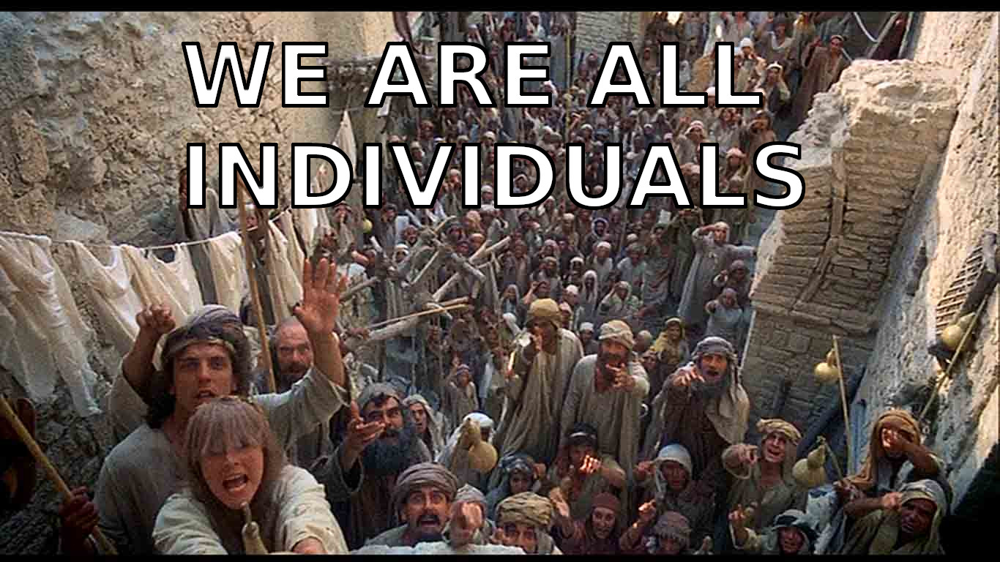

# Der Staat ist ein gefährliches Raubtier

Sobald Libertarismus praktisch wird, droht direkt die Politisierung.
Wie schlagen uns exakt auf der gegenüberliegenden Seite ins Dickicht und gehen antipolitisch bis apolitisch vor.
Die korrekte analytische Haltung ist dabei die Bedingung dafür, auch praktisch die richtigen Schlüsse zu ziehen.

## Die Lösung: Beschränke deinen Individualismus auf dich

Es fehlt jetzt noch, dass ich damit schließe, dass die Demokratie eben *das beste aller schlechten Systeme sei* und oben drauf noch darauf verweise, dass es in beide Richtungen Extreme gibt, die sich die Waage halten müssen.
Nein, über diesen Punkt bin ich persönlich hinaus.
Auch dass die Massen Führung bräuchten – dass das, was für mich funktioniert, gesamtgesellschaftlich nicht ginge, stößt bei mir auf taube Ohren.
Ich möchte einen anderen Vorschlag machen.

{{#template comment_thread.tpl threadid:drachenanderleine-individualismus}}

Der Staat ist ein Drachen, ein großes, gefährliches Wesen, das Feuer speit und gegen das die verfügbaren Waffen – Fackel und Mistgabel – nichts ausrichten.
Der Drachen ist außerdem völlig unberechenbar, darüber hinaus nicht intelligent und keiner Sprache mächtig.
Um das Bild komplett zu machen: Jeder Mensch ist insofern Bestandteil des Staates – des Drachens – wie er eben staatsgläubig ist und im Dienste des Staates handelt.
Wenn ein guter Freund glaubt, mich zur Rechenschaft ziehen zu müssen, für nicht versteuerte Gewinne aus dem Handel mit Bitcoin, dann sehe ich in ihm in dem Moment nur den Drachen.
Umgekehrt halte ich jedem Passanten die Tür auf, wenn mir danach ist, auch wenn es sich um einen Bundestagsabgeordneten handelt.
Es riecht auch nicht nach Schwefel, wenn Angela Merkel einkaufen geht. *Fairerweise: wenn der Einkauf für das Foto in der Bild-Zeitung gestellt war, stinkt die Sache natürlich schon.*
Wenn ich dem Drachen zu nahe komme, beißt er mir schlicht den Kopf ab.
Ich werde verzehrt wie schon sehr viele Menschen vor mir.
Manchmal sucht der Drachen auch Dörfer heim, wo die Menschen schlafen und ihrem Alltag nachgehen.
Nicht jeder, der gefressen wird, hat sich überhaupt mit dem Drachen angelegt.

{{#template comment_thread.tpl threadid:drachenanderleine-derdrachen}}

Was ich jetzt beobachte: Wenn der Drachen zuschlägt, tun die meisten Menschen so, als wäre der gar nicht da.
Selbst wenn ein unschuldiges Kind gefressen wird, heißt es mit Schulterzucken: *selbst Schuld* und: *mir tut er nichts*.
Wenn ich aufschreie, um vor dem Drachen zu warnen, bekomme ich mitleidige Blicke, als wäre ich der Dorftrottel.

Was bleibt mir also?
Mir scheint, als hätte sich irgendwo eine kleine Gruppe von Libertären gefunden, die sich regelmäßig in einem dunklen Winkel der Dorfkneipe treffen, um einmal die Woche gemeinsam über den Drachen zu schimpfen.
Dort wird sich offen ausgetauscht über die letzten Angriffe und die Opfer.
Aber auch hier ist jedem klar: Der direkte Angriff auf den Drachen ist der sichere Tod.
Ein *Heldentod* wäre schon zu viel gesagt, weil so wenig Heldenhaftes daran ist, vom Drachen gefressen zu werden.
Dass man den Drachen gemeinsam **hassen** müsse, darüber ist man sich einig.
Warum das wichtig sei, lässt sich hier nachlesen: [Rothbard: Do You Hate the State?](https://mises.org/library/do-you-hate-state) und eine gute Antwort hier: [Friedman: Murray Rothbard on Me and Vice Versa](http://daviddfriedman.blogspot.com/2011/06/murray-rothbard-on-me-and-vice-versa.html).

{{#template comment_thread.tpl threadid:drachenanderleine-rothbardhasst}}

Ich teile Friedmans Position und sehe keinen Wert darin, ein Tier zu hassen.
Interessanterweise ist recht einleuchtend, dass Hass auf ein Tier unangemessen ist – selbst wenn es mich attackiert hat.
Ich verteidige mich vielleicht, aber sobald von dem Tier keine akute Gefahr mehr ausgeht, beruhigen sich meine Gefühle schnell.
So gesehen gehen wir mit Raubtieren sogar besser um, als mit Menschen, die wir ob ihrer bösen Absichten zurecht zu hassen meinen.
Wenn sich eines Tages eine größere Gruppe zusammenrottet, um gemeinsam mit besserer Erfolgsaussicht den Drachen zu bezwingen, würde ich zu Hause bleiben.
Für das, was ich vorhabe, soll mir der Drachen eins sein.
Den Wald, in dem er wohnt, meide ich.
Rückblickend wirkt es so einfach: Vielleicht bin ich in einem Dorf nah am Drachenhort aufgewachsen und einfach nie auf die Idee gekommen, von dort wegzuziehen.
Jetzt wirkt es für mich komplett irrsinnig, wenn ich den dagebliebenen Menschen dabei zusehe, wie sie ihren ganzen Alltag entlang der Launen des Drachens gestalten, um schweigend seinen Flammen zu entgehen.

{{#template comment_thread.tpl threadid:drachenanderleine-irrsinnig}}

Genug der Metapher.
Ich bin ausgewandert und genieße schier unermessliche Freiheit.
Deutschland macht einem das Auswandern sehr leicht – nur wer nachweislich unternehmerischen Erfolg in Deutschland zu verbuchen hat, muss aufs Auswandern Extrasteuern zahlen.
Natürlich gibt es aber praktische Hürden fürs Auswandern: Kulturelle Bindung, Freunde, Besitz usw.
Ich sympathisiere auch mit Menschen, die es als ungerecht empfinden, auswandern zu müssen, um ihren noch so bescheidenen Traum von Freiheit zu verwirklichen.
Was soll ich sagen? Du bist in Gefangenschaft geboren worden.
Die Heimaterde ist verseucht.
Deutschland lässt keine Aussteiger innerhalb der Landesgrenzen zu.
Ich kann in den Wald ziehen – oder besser: auf meinem Grundstück meine Tomaten anbauen und in Kombination mit einem Hühnerstall grundsätzlich gut leben.
Ich zahle keine Miete und keine Einkommensteuer, muss aber schon aufpassen, wenn ich mir beim Ernten helfen lasse: Geldwerte Vorteile sind einkommensteuerpflichtig!
Als «Aussteiger» bin ich mir vielleicht selbst genug, habe mich von Geld sogar losgesagt.
Dann macht mir in Deutschland immer noch die Krankenversicherungspflicht einen Strich durch die Rechnung.
Jeden Monat laufen Forderungen auf.
Erst wird mein Konto gepfändet, dann mein Besitz.
Um in Frieden leben zu dürfen, muss ich zumindest den Versicherungsbeitrag von rund 200 EUR im Monat also erwirtschaften.
In der Realität muss also nicht nur im Sozialismus sondern auch in der freiheitlich-demokratischen Grundordnung für das System gearbeitet werden.
Die wesentlich einfachere Alternative: Den Drachen anzapfen und direkt als Sozialhilfeempfänger auftreten.
Man kriegt nicht viel, entgeht aber schon einmal der Zahlung an das gesetzliche Krankenversicherungskartell.
Wenn ich aber nicht wirklich ein Sozialhilfeempfängerdasein führen will, heißt das: Besitz und Einkommen verschweigen.
Ich trete damit ein in den Klub der Kriminellen.
Dass das praktisch viele Jahre sehr gut gehen kann, ändert nichts an dem prinzipiellen Risiko, das ich damit eingehe.
Für die Leute, die ich aus meinem Umfeld kenne, wäre das nichts.
Freunde und Bekannte müssten meine opportunistische Haltung teilen, sonst droht das Verpfeifen. Ich habe den Drachen quasi in meinem Wohnzimmer.

{{#template comment_thread.tpl threadid:drachenanderleine-ausgewandert}}

Zum Glück gibt es das Internet und nicht wenige Selbstständige, die damit ihr Geld verdienen.
Wer selbständig *online* arbeitet, hat durch das Auswandern handfeste materielle Vorteile.
Wer Steuern komplett sparen kann, dem steht auf einmal rund doppelt so viel zur Verfügung.
Das bietet viel Spielraum, um einen Auswanderer-Lebensstil zu finanzieren und dementsprechend ziehen diese nicht in den Wohnblock eines Warschauer Vororts, sondern eher in das Hostel am Strand in Thailand.
Ein nachhaltiges Konzept muss dann die dauerhafte Steuervermeidung beinhalten – auch keine neue Steuerpflicht am neuen Wohnort – und hier kommt das erstaunliche:
Viele Länder ermöglichen genau das.
Wer bereits weiß, wie internationale Konzerne Steuern vermeiden, findet daran überhaupt nichts erstaunlich.
Irland, England und Malta sind Niedrigsteuerländer innerhalb der EU – vorausgesetzt ich bin dort nicht Staatsbürger.
Zypern bietet das ganz legale Null-Steuern-Modell im Mittelmeer – leider weiter weg als man glaubt, südlich der Türkei – mit Klima-Upgrade oben drauf.
Rückblickend hab ich die ganze Zeit vor dem Auswandern praktisch freiwillig Steuern gezahlt – so leicht wirkt alles im Nachhinein.

{{#template comment_thread.tpl threadid:drachenanderleine-digitalenomaden}}

Und was ist aus der Rettung der Welt geworden?
Die ist nicht mein Anliegen.
Ich muss nicht – wie Neo – die Matrix zerstören.
Jegliche negative Emotion gegen den tötenden Drachen löst sich außerdem in Luft auf.
Den Daheimgebliebenen schicke ich eine Postkarte.
Wer einen ähnlichen Weg einschlagen will, wird alle meine Hilfe erfahren.
Die Gemeinschaft der Staatenlosen wächst.
Christoph Heuermann hat das Wort positiv umgemünzt; mit der Abgabe der Staatsbürgerschaft hat «staatenlos sein» nichts zu tun.
Uns steht eine Weiterentwicklung bevor, das nächste Level.
Das Stichwort ist *mobiles Unternehmertum*.
Die Organisation von Wertschöpfung losgelöst von staatlichen Zwängen beinhaltet neue Möglichkeiten und Herausforderungen. Dazu an anderer Stelle mehr.

{{#template comment_thread.tpl threadid:drachenanderleine-mobilesunternehmertum}}

Ich behaupte, der Drachen ist damit eigentlich besiegt.
In den Details gibt es sicherlich noch viel mehr dazu zu sagen.
Möglicherweise ist das unbeschwerte legale Auswandern nur jetzt gerade, in einem kleinem Zeitfenster möglich.
Praktisch ist aber absehbar, dass das Auswandern – wenngleich unter erschwerten Bedingungen – auch in Zukunft die Strategie Nr. 1 für Freiheit vom Staat sein wird.
Wer die Welt einmal aus der Sicht eines mobilen Unternehmers gesehen hat, sieht in jedem weiteren Staat neue Möglichkeiten, neue Optionen und nicht mehr die Zwänge.
Selbst innerhalb der EU ist es möglich, Staaten gegeneinander auszuspielen.

{{#template comment_thread.tpl threadid:drachenanderleine-derdrachenistbesiegt}}

Allzu oft sehen wir in dem Drachen noch eine Art menschliche Intelligenz und versuchen, ihm zuzureden oder wir glauben größenwahnsinnig, er hätte es auf uns persönlich abgesehen.
Die Realität: Die Art und Weise wie im Staat Regeln und Gesetze gemacht werden, resultiert systematisch in Strukturen, die von Einzelnen unterwandert werden können.
Deshalb gehört gar nicht so viel dazu, den Verfolgern einen Schritt voraus zu sein.
Eine prominente Ausnahme wäre da Kim Dotcom.
Anders als Julian Assange und Edward Snowden hat sich Kim Dotcom – ein deutscher Internet-Unternehmer – gar nicht direkt mit dem Staat angelegt.
Am 19. Januar 2012 wurde er auf seinem Grundstück in Neuseeland vom FBI überfallen und sein komplettes Vermögen wurde beschlagnahmt.
Es droht bis heute Auslieferung in die USA und bis zu 20 Jahre Haft wegen Verletzung des Urheberrechts auf seiner Plattform *megaupload*.
Ross Ulbricht ist in dem Zusammenhang auch ein bemerkenswerter Fall.
Es ist weniger überraschend, dass Ulbricht als Betreiber von *Silk Road* ins Visier des FBI geraten ist – denn Silk Road ermöglichte unter Anderem den anonymen Handel mit Drogen.
Beeindruckend ist das harsche Urteil, dass den jungen, libertären Programmierer für den Rest seines Lebens ins Gefängnis verbannt.
Man darf davon ausgehen, dass in beiden Fällen ein Exempel statuiert werden sollte.
Und dahinter steckt eine leicht zu durchschauende Strategie:
Eine flächendeckende Verfolgung der vielen kleineren und größeren Urheberrechtsverletzer und Drogenhändler ist auch dem FBI nicht möglich und so bleibt noch die Abschreckung.
Die Beispiele Julian Assange und Edward Snowden zeigen zudem, dass die Flucht in das richtige Land zumindest eine gewisse Sicherheit bieten kann.

{{#template comment_thread.tpl threadid:drachenanderleine-kimdotcom}}

Der mobile Unternehmer weiß um all diese Risiken.
Typischerweise ist er mit seinen Geschäften allenfalls einmal in einem rechtlichen Graubereich unterwegs und gerät nicht im Ansatz in das Visier der Justiz.
*Vor allem der US-amerikanischen Justiz gilt es, systematisch und weiträumig aus dem Weg zu gehen. Kein anderes Land hat vergleichbaren internationalen Durchgriff.*
Man sei daran erinnert, wie glimpflich selbst das Dritte Reich für diejenigen Juden verlaufen ist, die rechtzeitig ausgewandert sind.
Dem mobilen Unternehmer – mit international diversifiziertem Wohnsitz – machen die Drohgebärden mächtiger Staaten auch in absehbarer Zukunft keine Angst.

{{#template comment_thread.tpl threadid:drachenanderleine-diversifizierterwohnsitz}}
