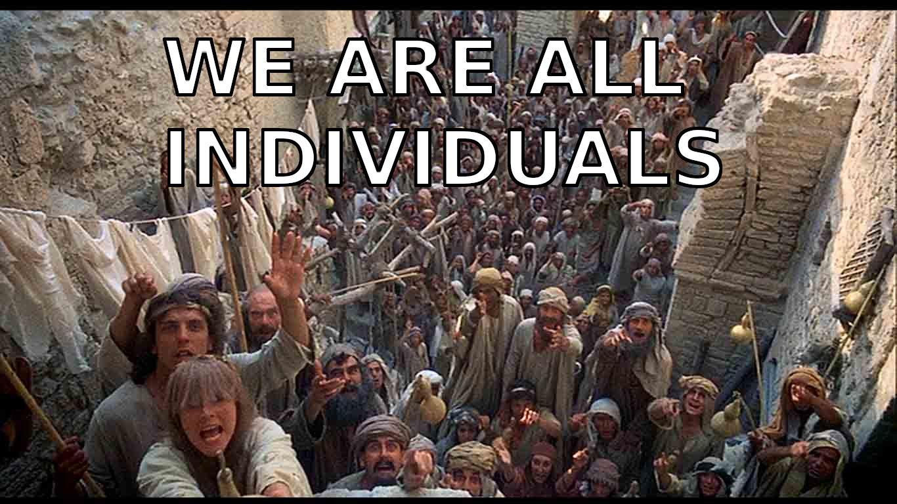

# Der Drachen an der Leine

- [ ] Zusammenfassung hier

## Ich höre hier immer nur «Staat, Staat, Staat»

Der Hamburger Anarcho-Kapitalismus-Stammtisch war ein voller Erfolg.
Der Start war nicht ganz einfach.
Auf der Suche nach Austausch habe ich eine Gruppe auf *meetup.com* gegründet, was mein Mitbewohner zum Anlass genommen hat, mich zu unterstützen, denn *meetup.com*, das kennt der.
Nun gilt aber bei der Haltung zum Staat und zu seinen Institutionen einmal mehr: das *Sein bestimmt das Bewusstsein*.
Mein Mitbewohner war Franzose und selbständiger Fotografenassistent, heißt: überwiegend arbeitslos.
Da war dann bei noch so viel Interesse argumentativ nicht viel zu machen.
Überhaupt ist gut möglich, dass er mich einfach als wirtschaftsliberal eingeordnet hat – als eine Art politikverdrossener FDP-Wähler vielleicht.
Mein Dank gilt ihm davon abgesehen ganz aufrichtig – immerhin waren wir zu Beginn also zu zweit.
Den Libertären Stammtisch der Pusters, der schon längst vorher existierte und mein Meetup nun auch überdauert, hab ich später erst kennengelernt.

{{#template comment_thread.tpl threadid:stammtisch}}

Es war zu Hochzeiten des Anarcho-Kapitalismus-Stammtisch, dass Sören uns alle zu sich nach Hause einlud und wir zu elft – zweistellig! – seinen Esstisch in Beschlag nahmen.
Die Treffen waren offen und auf *meetup.com* einsehbar.
So war ein besonderes Feature unseres Stammtisches, dass sich immer auch wieder Gestalten einfanden, die nicht wirklich wussten, worum es überhaupt geht.
Das Wort «Anarcho» in der Beschreibung war für so jemanden hinreichend, um davon auszugehen: Da kann ich mal hingehen und richtig diskutieren!
«Richtig diskutieren» stimmt dann aber leider auch wieder nicht.
Denn das können die Wenigsten.
Vielmehr gibt es das Bedürfnis, schlicht angehört zu werden.
Als ich noch mit meinem Mitbewohner allein war, war das eher anstrengend: Für mich ein zwei gegen eins.
Jetzt war das anders.
Durch seine langen Haare sah unser Gast aus wie eine jugendliche Variante von Richard David Precht, nennen wir ihn also Richard.
Richards Wortbeiträgen wurde zu seiner Verwunderung konsequent widersprochen.
Das wirklich jemand die Ursache diskussionswürdiger sozialer Herausforderung schlicht in der Existenz des Staates sieht, war für Richard etwas völlig neues.
Und auf neue Information reagiert das menschliche Gehirn in den seltensten Fällen mit Interesse.
Die normale Reaktion ist: Irritation, Ablehnung, Defensive.
Überhaupt: Eigentlich war Richard ein lieber Kerl, der nur ein bisschen quatschen wollte.
Vielleicht hat der Freunde gesucht – zumindest aber Zustimmung.
So oder so war es aussichtslos und nach einer Dreiviertelstunde holte Richard zum letzten Mal zum Schlag aus mit den Worten:

*«Ich höre hier immer nur Staat, Staat, Staat. Wir müssen mal über das **Kapital** reden!»*

Es gab Gepolter, eine kurze Klarstellung der Begrifflichkeiten, darunter auch die Bedeutung von «Anarcho-Kapitalismus» wie in «anarcho-kapitalistischer Stammtisch» und unser Gast empfahl sich.
Den Staat an sich zu problematisieren, ist unüblich und in aller Regel eine Provokation.
Es wäre einfach, wenn es um den deutschen Staat ginge oder, besser noch, die USA.
Aber es geht um Etatismus, Herrschaft, unterbewusste Staatsgläubigkeit, die **demokratische Prämisse**, die die Phrase *Wir leben ja schließlich in einer Demokratie* in den Stand eines Arguments erheben soll.
Die Fundamentalopposition gegen den Staat an sich definiert den Libertarismus.
Doch auch unter Libertären ist Etatismus allein kein dauerhaft ergiebiges Diskussionsthema für alle.
Da mischt sich dann alles mögliche mit rein: *Darum AfD!*, offene Grenzen, geschlossene Grenzen, Feminisierung, *Trump!*, *eben nicht AfD*, die Medien, Klima, Grönemeyer, Corona, hin und wieder gar *der Jude* und die Rothschilds.

{{#template comment_thread.tpl threadid:gepolter}}

## Dabei hat der Libertarismus viel zu bieten

Man könnte das «memetischen Druck» nennen: Libertarismus hat mich davon befreit, täglich Spiegel Online zu lesen.
Mein Gehirn **will** aber konsumieren, weiterleiten, sich empören, eine Meinung zu Dingen haben.
Ein Bekenntnis zum Libertarismus beinhaltet auch nicht zwingend, ein Buch gelesen zu haben, was libertäre Philosophie in ihrer Popularität begrenzt.
Zum Glück ist dieses Bild so nicht vollständig und Anleitungen zu einem, sagen wir, **praktischem Libertarismus** gibt es beispielsweise von

* **Christoph Heuermann**: Wandere aus und gebrauche Staaten fortan zu deinem Zwecke! – und
* **Oliver Heuler**, für den Libertarismus Teil einer persönlichen Entwicklung ist, mit dem Ziel, sich vom Sollte-Denken zu befreien.

Ich gehöre zu den Menschen, die Bücher gelesen haben, und bin der Meinung, libertäre Philosophie wird unterschätzt – was mich nicht davon abgehalten hat, **auch** auszuwandern und mich – inspiriert durch Oliver – in Gelassenheit zu üben.
Mit dem Etatismus ist das wie mit dem Sollte-Denken: Ganz zu Anfang habe ich meinen Staatsglauben als solchen identifiziert.
Jetzt kann ich alle meine heimlichen Überzeugungen explizit machen und hinterfragen.
Die Fragen, die dabei auftauchen, gehen weit über *Wer baut dann die Straßen?* hinaus, wobei das nicht einmal ein schlechter Start ist.
Eine dieser Fragen, die internetgerecht unter *Muh' roads* zusammengefasst werden, lautet:
Ohne Staat, würden dann nicht brutale Kriegsherren die Macht übernehmen?
Die kompetente Beantwortung dieser Frage mit den Mitteln der Praxeologie findet sich in Robert Murphys Essay: [Wouldn't warlords take over](https://mises.org/library/wouldnt-warlords-take-over).
Da geht es um die Effektivität privatwirtschaftlich organisierter Verteidigung und natürlich die ökonomische Effizienz von Verteidigung gegenüber offensiver Kriegsführung.
Letztere verschlingt am Beispiel der USA den Löwenanteil des Rüstungsbudgets und fällt für eine friedliche *Privatrechtsgesellschaft* komplett weg.
In der Praxis stellen die wenigsten Libertarismus-Kritiker allzu viele Fragen, die über *Muh' roads* hinausgehen, und kommen nie in den Genuss von Robert Murphys Einsichten. Mein persönlicher Favorit ist sein [Vortrag auf YouTube: Würde es in der freien Gesellschaft Gefängnisse geben?](https://www.youtube.com/watch?v=SzYJYSm-MfI)

{{#template comment_thread.tpl threadid:libertaere-buecher}}

Mich überzeugt Robert Murphy grundsätzlich und ich habe seine Texte und Vorträge verschlungen.
Allerdings gibt es eine Einschränkung.
Mit den Worten «In einer freien Gesellschaft ...» wird eine Utopie eingeleitet und Utopien malen in der Regel nur etwas aus für jemanden, der in den Grundannahmen schon übereinstimmt.
So kann mich kommunistische Utopie beispielsweise nicht davon überzeugen, mich von Eigentum loszusagen.
Wer sich vor Eigentum dagegen ekelt – nicht nur, aber auch weil er tendenziell wenig davon hat – freut sich dagegen darüber, dass ihm jemand die Welt des «kollektiven Besitzes» rosa-rot ausmalt.

{{#template comment_thread.tpl threadid:utopie}}

## Eine freie Gesellschaft mit Atomstrom und Laser-Show? Ist ja widerlich

Zurück zu der Machtübernahme durch brutale Kriegsherren.
Vielleicht liefert Robert Murphy mit der praxeologischen Analyse nur eine Hälfte der Antwort.
In dem realen Verlauf der Geschichte kommen Staaten nun einmal vor.
Die *normative Kraft des Faktischen* haben sie schon mal auf ihrer Seite.
Spaß beiseite: Es gelingt mir nicht, gedanklich eine klare Trennlinie zu ziehen zwischen der Herrschaft, die Zwang und Täuschung ausnutzt, und den Beherrschten.
Diese Beherrschten offenbaren in ihrem Handeln individuelle Absichten, Wünsche, Pläne – auch ihre biologischen Triebe.
Meinem Verständnis nach gibt es über diese *individuellen Präferenzen* hinaus nichts normatives, nichts was objektiv vorgibt richtig oder falsch zu sein.
Auch altbewährte Regeln müssen sich eben daran messen lassen, ob ich heute mit meinen Mitmenschen zu dem Schluss komme, dass ich diese Regeln *will*.
Gott, Staat und Moral als Regelgeber sind Geschöpfe meines Geistes und oft genug lediglich Gespenster, die ich zu verscheuchen suche.
Aber hier kommt die Crux: Mein katholischer Nachbar verlangt von mir, dass ich seinen Gott respektieren möge – und vielleicht lüge ich ihm zuliebe – aber seine Kirche, an die er 5% seines Einkommens zahlt, werde ich nicht einreißen.
Und nicht nur, dass ich keine Kirchen einreiße: Wo ich hinschaue werden neue Kirchen gebaut.
Das Bedürfnis nach Gott scheint universell zu sein – und dieses Bedürfnis scheint über alle damit verbundenen Widersprüche erhaben zu sein.
Ich weiß, dass ein Bedürfnis *beherrscht zu werden* inhärent inkonsistent ist.
*Na, und?* denkt sich der Demokrat und setzt unbeirrt seinen Weg ~~zur Pilgerstätte~~ zum Wahllokal fort.
Die *freie Gesellschaft*: rationaler als der Staat und ökonomisch überlegen.
Trotzdem können wir nicht beobachten, wie die freie Gesellschaft staatliche Gewalt verdrängt hat.
Es zeichnet sich nicht einmal eine entsprechende Tendenz ab.
Im Staat wird gegen Fortschritt, der den Staat eventuell überflüssig macht, aktiv angegangen.
Das wiederum – diese fortgesetzte Ineffizienz inklusive größerer und kleinerer gewaltsamer Exzesse – charakterisiert genau den Staat.
Ein Teufelskreis.

{{#template comment_thread.tpl threadid:praeferenzen}}

Ein Gedankenexperiment:
Ich stelle mir vor, die Kleinstädte Schleswig-Holsteins hätten sich in eine freie Gesellschaft verwandelt.
Wo ich früher den Blick auf die Kuhweiden genossen hab, sehe ich jetzt ein modernes Atomkraftwerk.
Wo früher ein gammliger Dorfplatz war: ein Einkaufszentrum mit Laser-Show.
Und mich ekelt das alles an.
Ich freue mich – unter anderem – über die niedrige Stromrechnung, will aber wirklich eigentlich nur die Kuhweiden sehen und sonst nichts.
Ich hasse das lärmige Einkaufszentrum, obwohl mich freut, dass meine Tochter da Arbeit gefunden hat.
Mit meinem Sohn gehe ich vielleicht jeden Sonntag in die Laser-Show.
Trotzdem trotzdem trotzdem.
Dass ich umziehen könnte, empfinde ich in diesem Gedankenexperiment als Zumutung.
Dass das, was ich will, am Ende widersprüchlich ist: geschenkt! – es geht ja noch weiter:
Ich will das Ordnungsamt zurück.
Ich will lieber zwei Stunden in der Behörde auf einen Termin warten, als die App zu benutzen.
Am liebsten will ich mich als Staatsbürger eines großen, erhabenen Deutschlands sehen, das die Vorherrschaft Europas beansprucht, friedlich meinetwegen, wirtschaftlich oder so – man ist ja liberal heutzutage.
Mein heimlicher Traum: Mein Sohn dient dem Vaterland an der Waffe.

{{#template comment_thread.tpl threadid:kuhweiden}}

Ist das so absurd?
Es ist nicht so lange her und entsprechende Wertvorstellungen waren weit verbreitet.
Der Kapitalismus als Motor des Fortschritts wird von den Menschen selten direkt gewollt.
Menschen wollen genug zu essen, Jeans, schnelles Internet usw.
Zusammen mit dem Bedürfnis nach nationaler Identität wird da schnell wieder das aktuelle Deutschland daraus, eine *soziale Marktwirtschaft*.
An dieser Stelle ist vielleicht ein libertäres Zugeständnis meinerseits hilfreich:
Eine reale Nachfrage nach Deutschland als Produkt ist zur Zeit schwer zu argumentieren.
Der Staat gibt vor, kollektive Interessen zu realisieren – das Gemeinwohl! – ist dabei aber gelinde gesagt ineffektiv.
Es ist nicht das Wesen des Staates eine Nachfrage zu bedienen.
Es ist Zwang, Gewalt, Täuschung, Herrschaft, die den Staat täglich möglich machen.
Aber damit ist das Gedankenexperiment noch nicht abgehakt.
Der Film «The Matrix» bringt es auf den Punkt:

*The Matrix is a system, Neo. That system is our enemy. But when you're inside, you look around, what do you see? Businessmen, teachers, lawyers, carpenters. The very minds of the people we are trying to save. But until we do, these people are still a part of that system and that makes them our enemy. You have to understand, most of these people are not ready to be unplugged. And many of them are so inured, so hopelessly dependent on the system that they will fight to protect it.*

{{#template comment_thread.tpl threadid:matrix}}

Der Systemtrottel mag irgendwo einer gewaltigen Täuschung unterliegen – OK.
Solange ich diese Täuschung aber nicht auflösen kann, ist das aus Sicht selbigen Systemtrottels eine bloße Unterstellung.
Sein Wunsch nach mehr Staat wird nicht ungültig, nur weil ich meine libertäre Theorie benutze, um diesen lächerlich zu machen.
Historisch war der Wunsch nach einem großen deutschen Staate auch eine Reaktion auf Napoleons Eroberungen im Namen des französischen Nationalismus.
Fehlgeleitet, vielleicht, aber gegeben dessen was ein Deutscher im 19. Jahrhundert weiß und versteht auch nicht schwer nachzuvollziehen, dass deutscher Nationalismus für mich einzelnen Deutschen attraktiv ist.
Natürlich hat sich die Welt verändert.
Napoleon ist längst vergessen.
Was damals plausibel schien, ist heute sicher keine Lösung mehr.
In Zeiten relativen Friedens müsste doch der Staat schrumpfen, Freiraum für libertäre Experimente zulassen, Ressourcen freigeben.
Regionale Alternativen zu demokratischer Herrschaft müssten so lange florieren, bis ein neuer europäischer Eroberer den Antritt zum Appell zur Verteidigung des Landes und der guten Werte erzwingt.

{{#template comment_thread.tpl threadid:systemtrottel}}

Hier macht uns der Staat einen Strich durch die Rechnung.
Deutschland als Konzept und in den heutigen Grenzen hat Generationen überlebt – auch 40 Jahre Teilung haben die Idee nur bestärkt.
Ein Staat, dessen Verteidigungszweck erfüllt wurde, schafft sich nicht ab, sondern er findet einen neuen Zweck für sich und weiß den auch unters Volk zu bringen.
Ein Programmierer, der mit der Aufgabe startet, eine Software zu bauen, muss häufig feststellen, dass sich die Anforderung an die Software im Nachhinein verändern.
Er weist dann den Kunden auf den *scope creep* hin, was ein pünktliches Fertig Werden unmöglich macht.
Staaten sind ein Fall von systematischem *scope creep*.
Der Staat selbst ist ein einziger *scope creep*.
Die NATO war ein Bündnis gegen die Sowjetunion und wurde dann ganz explizit umfunktioniert in ein Bündnis gegen internationalen Terrorismus.
Dass die NATO-Partner also mit stehendem Heer und Düsenjägern gegen Bombenleger im Einkaufszentrum vorgehen wollen, erschien hinreichend plausibel.
Ob man von internationalem Terrorismus spricht, weil die Bombenleger heutzutage Migrationshintergrund haben?
Ähnlich lächerlich ist das Fortbestehen der deutschen Bundesbank nach Einführung des Euros.
Die Funktion der Bundesbank kann nun jedenfalls nicht mehr die einer Zentralbank sein – dazu gibt es nun die EZB.
Nein, die Bundesbank ist jetzt «integraler Bestandteil des Systems der nationalen Zentralbanken [die alle ihrer zentralen Aufgabe beraubt wurden und nutzlos sind]».
Noch Fragen?
Und doch geht es dem Libertären heute wie Neo in der Matrix: Wo man hinguckt, Systemtreue.
Die «Kritiker» des Staates sind geeint in dem Kampf gegen Kapitalismus, Rassismus, Ungleichheit und globale Erwärmung.
Sie beschwören die Politiker, im Dienste dieser hehren Anliegen doch bitte, bitte mehr zu tun.
Der Deutsche will seinen Staat mit allem, was dazu gehört.

{{#template comment_thread.tpl threadid:bundesbank}}

Auch Morpheus Lösung, die blutigen Kollateralschaden unter den Systemtrotteln vorsieht, wird unter Libertären diskutiert.
Ironischerweise standen die Bolschewisten vor der gleichen Herausforderung: Sie, die die Wahrheit hatten, gegen die, die im blinden Glauben an das alte System, den letztlich unvermeidlichen Fortschritt aufzuhalten drohen.
Und natürlich haben diejenigen als erstes den Tod gefunden, die sozialistisch waren nur eben nicht auf einer Linie mit den Bolschewisten.
Nach der Logik müssten die Anarcho-Kapitalisten zuerst einmal durch gezielte Hinrichtungsaktionen die Minarchisten ausschalten, dann kämen Massenerschießungen für die Ordoliberalen und die Konservativen, während man für die Parteimitglieder der Grünen zuletzt ganz in Ruhe die Lagerlogistik vorbereitet.

Ich gebe zu, jetzt ist es doch absurd geworden.

{{#template comment_thread.tpl threadid:absurd}}

## Die Lösung: Beschränke deinen Individualismus auf dich

Es fehlt jetzt noch, dass ich damit schließe, dass die Demokratie eben *das beste aller schlechten Systeme sei* und oben drauf noch darauf verweise, dass es in beide Richtungen Extreme gibt, die sich die Waage halten müssen.
Nein, über diesen Punkt bin ich persönlich hinaus.
Auch dass die Massen Führung bräuchten – dass das, was für mich funktioniert, gesamtgesellschaftlich nicht ginge, stößt bei mir auf taube Ohren.
Ich möchte einen anderen Vorschlag machen.

{{#template comment_thread.tpl threadid:individualismus}}

Der Staat ist ein Drachen, ein großes, gefährliches Wesen, das Feuer speit und gegen das die verfügbaren Waffen – Fackel und Mistgabel – nichts ausrichten.
Der Drachen ist außerdem völlig unberechenbar, darüber hinaus nicht intelligent und keiner Sprache mächtig.
Um das Bild komplett zu machen: Jeder Mensch ist insofern Bestandteil des Staates – des Drachens – wie er eben staatsgläubig ist und im Dienste des Staates handelt.
Wenn ein guter Freund glaubt, mich zur Rechenschaft ziehen zu müssen, für nicht versteuerte Gewinne aus dem Handel mit Bitcoin, dann sehe ich in ihm in dem Moment nur den Drachen.
Umgekehrt halte ich jedem Passanten die Tür auf, wenn mir danach ist, auch wenn es sich um einen Bundestagsabgeordneten handelt.
Es riecht auch nicht nach Schwefel, wenn Angela Merkel einkaufen geht. *Fairerweise: wenn der Einkauf für das Foto in der Bild-Zeitung gestellt war, stinkt die Sache natürlich schon.*
Wenn ich dem Drachen zu nahe komme, beißt er mir schlicht den Kopf ab.
Ich werde verzehrt wie schon sehr viele Menschen vor mir.
Manchmal sucht der Drachen auch Dörfer heim, wo die Menschen schlafen und ihrem Alltag nachgehen.
Nicht jeder, der gefressen wird, hat sich überhaupt mit dem Drachen angelegt.

{{#template comment_thread.tpl threadid:derdrachen}}

Was ich jetzt beobachte: Wenn der Drachen zuschlägt, tun die meisten Menschen so, als wäre der gar nicht da.
Selbst wenn ein unschuldiges Kind gefressen wird, heißt es mit Schulterzucken: *selbst Schuld* und: *mir tut er nichts*.
Wenn ich aufschreie, um vor dem Drachen zu warnen, bekomme ich mitleidige Blicke, als wäre ich der Dorftrottel.

Was bleibt mir also?
Mir scheint, als hätte sich irgendwo eine kleine Gruppe von Libertären gefunden, die sich regelmäßig in einem dunklen Winkel der Dorfkneipe treffen, um einmal die Woche gemeinsam über den Drachen zu schimpfen.
Dort wird sich offen ausgetauscht über die letzten Angriffe und die Opfer.
Aber auch hier ist jedem klar: Der direkte Angriff auf den Drachen ist der sichere Tod.
Ein *Heldentod* wäre schon zu viel gesagt, weil so wenig Heldenhaftes daran ist, vom Drachen gefressen zu werden.
Dass man den Drachen gemeinsam **hassen** müsse, darüber ist man sich einig.
Warum das wichtig sei, lässt sich hier nachlesen: [Rothbard: Do You Hate the State?](https://mises.org/library/do-you-hate-state) und eine gute Antwort hier: [Friedman: Murray Rothbard on Me and Vice Versa](http://daviddfriedman.blogspot.com/2011/06/murray-rothbard-on-me-and-vice-versa.html).

{{#template comment_thread.tpl threadid:rothbardhasst}}

Ich teile Friedmans Position und sehe keinen Wert darin, ein Tier zu hassen.
Interessanterweise ist recht einleuchtend, dass Hass auf ein Tier unangemessen ist – selbst wenn es mich attackiert hat.
Ich verteidige mich vielleicht, aber sobald von dem Tier keine akute Gefahr mehr ausgeht, beruhigen sich meine Gefühle schnell.
So gesehen gehen wir mit Raubtieren sogar besser um, als mit Menschen, die wir ob ihrer bösen Absichten zurecht zu hassen meinen.
Wenn sich eines Tages eine größere Gruppe zusammenrottet, um gemeinsam mit besserer Erfolgsaussicht den Drachen zu bezwingen, würde ich zu Hause bleiben.
Für das, was ich vorhabe, soll mir der Drachen eins sein.
Den Wald, in dem er wohnt, meide ich.
Rückblickend wirkt es so einfach: Vielleicht bin ich in einem Dorf nah am Drachenhort aufgewachsen und einfach nie auf die Idee gekommen, von dort wegzuziehen.
Jetzt wirkt es für mich komplett irrsinnig, wenn ich den dagebliebenen Menschen dabei zusehe, wie sie ihren ganzen Alltag entlang der Launen des Drachens gestalten, um schweigend seinen Flammen zu entgehen.

{{#template comment_thread.tpl threadid:irrsinnig}}

Genug der Metapher.
Ich bin ausgewandert und genieße schier unermessliche Freiheit.
Deutschland macht einem das Auswandern sehr leicht – nur wer nachweislich unternehmerischen Erfolg in Deutschland zu verbuchen hat, muss aufs Auswandern Extrasteuern zahlen.
Natürlich gibt es aber praktische Hürden fürs Auswandern: Kulturelle Bindung, Freunde, Besitz usw.
Ich sympathisiere auch mit Menschen, die es als ungerecht empfinden, auswandern zu müssen, um ihren noch so bescheidenen Traum von Freiheit zu verwirklichen.
Was soll ich sagen? Du bist in Gefangenschaft geboren worden.
Die Heimaterde ist verseucht.
Deutschland lässt keine Aussteiger innerhalb der Landesgrenzen zu.
Ich kann in den Wald ziehen – oder besser: auf meinem Grundstück meine Tomaten anbauen und in Kombination mit einem Hühnerstall grundsätzlich gut leben.
Ich zahle keine Miete und keine Einkommensteuer, muss aber schon aufpassen, wenn ich mir beim Ernten helfen lasse: Geldwerte Vorteile sind einkommensteuerpflichtig!
Als «Aussteiger» bin ich mir vielleicht selbst genug, habe mich von Geld sogar losgesagt.
Dann macht mir in Deutschland immer noch die Krankenversicherungspflicht einen Strich durch die Rechnung.
Jeden Monat laufen Forderungen auf.
Erst wird mein Konto gepfändet, dann mein Besitz.
Um in Frieden leben zu dürfen, muss ich zumindest den Versicherungsbeitrag von rund 200 EUR im Monat also erwirtschaften.
In der Realität muss also nicht nur im Sozialismus sondern auch in der freiheitlich-demokratischen Grundordnung für das System gearbeitet werden.
Die wesentlich einfachere Alternative: Den Drachen anzapfen und direkt als Sozialhilfeempfänger auftreten.
Man kriegt nicht viel, entgeht aber schon einmal der Zahlung an das gesetzliche Krankenversicherungskartell.
Wenn ich aber nicht wirklich ein Sozialhilfeempfängerdasein führen will, heißt das: Besitz und Einkommen verschweigen.
Ich trete damit ein in den Klub der Kriminellen.
Dass das praktisch viele Jahre sehr gut gehen kann, ändert nichts an dem prinzipiellen Risiko, das ich damit eingehe.
Für die Leute, die ich aus meinem Umfeld kenne, wäre das nichts.
Freunde und Bekannte müssten meine opportunistische Haltung teilen, sonst droht das Verpfeifen. Ich habe den Drachen quasi in meinem Wohnzimmer.

{{#template comment_thread.tpl threadid:ausgewandert}}

Zum Glück gibt es das Internet und nicht wenige Selbstständige, die damit ihr Geld verdienen.
Wer selbständig *online* arbeitet, hat durch das Auswandern handfeste materielle Vorteile.
Wer Steuern komplett sparen kann, dem steht auf einmal rund doppelt so viel zur Verfügung.
Das bietet viel Spielraum, um einen Auswanderer-Lebensstil zu finanzieren und dementsprechend ziehen diese nicht in den Wohnblock eines Warschauer Vororts, sondern eher in das Hostel am Strand in Thailand.
Ein nachhaltiges Konzept muss dann die dauerhafte Steuervermeidung beinhalten – auch keine neue Steuerpflicht am neuen Wohnort – und hier kommt das erstaunliche:
Viele Länder ermöglichen genau das.
Wer bereits weiß, wie internationale Konzerne Steuern vermeiden, findet daran überhaupt nichts erstaunlich.
Irland, England und Malta sind Niedrigsteuerländer innerhalb der EU – vorausgesetzt ich bin dort nicht Staatsbürger.
Zypern bietet das ganz legale Null-Steuern-Modell im Mittelmeer – leider weiter weg als man glaubt, südlich der Türkei – mit Klima-Upgrade oben drauf.
Rückblickend hab ich die ganze Zeit vor dem Auswandern praktisch freiwillig Steuern gezahlt – so leicht wirkt alles im Nachhinein.

{{#template comment_thread.tpl threadid:digitalenomaden}}

Und was ist aus der Rettung der Welt geworden?
Die ist nicht mein Anliegen.
Ich muss nicht – wie Neo – die Matrix zerstören.
Jegliche negative Emotion gegen den tötenden Drachen löst sich außerdem in Luft auf.
Den Daheimgebliebenen schicke ich eine Postkarte.
Wer einen ähnlichen Weg einschlagen will, wird alle meine Hilfe erfahren.
Die Gemeinschaft der Staatenlosen wächst.
Christoph Heuermann hat das Wort positiv umgemünzt; mit der Abgabe der Staatsbürgerschaft hat «staatenlos sein» nichts zu tun.
Uns steht eine Weiterentwicklung bevor, das nächste Level.
Das Stichwort ist *mobiles Unternehmertum*.
Die Organisation von Wertschöpfung losgelöst von staatlichen Zwängen beinhaltet neue Möglichkeiten und Herausforderungen. Dazu an anderer Stelle mehr.

{{#template comment_thread.tpl threadid:mobilesunternehmertum}}

Ich behaupte, der Drachen ist damit eigentlich besiegt.
In den Details gibt es sicherlich noch viel mehr dazu zu sagen.
Möglicherweise ist das unbeschwerte legale Auswandern nur jetzt gerade, in einem kleinem Zeitfenster möglich.
Praktisch ist aber absehbar, dass das Auswandern – wenngleich unter erschwerten Bedingungen – auch in Zukunft die Strategie Nr. 1 für Freiheit vom Staat sein wird.
Wer die Welt einmal aus der Sicht eines mobilen Unternehmers gesehen hat, sieht in jedem weiteren Staat neue Möglichkeiten, neue Optionen und nicht mehr die Zwänge.
Selbst innerhalb der EU ist es möglich, Staaten gegeneinander auszuspielen.

{{#template comment_thread.tpl threadid:derdrachenistbesiegt}}

Allzu oft sehen wir in dem Drachen noch eine Art menschliche Intelligenz und versuchen, ihm zuzureden oder wir glauben größenwahnsinnig, er hätte es auf uns persönlich abgesehen.
Die Realität: Die Art und Weise wie im Staat Regeln und Gesetze gemacht werden, resultiert systematisch in Strukturen, die von Einzelnen unterwandert werden können.
Deshalb gehört gar nicht so viel dazu, den Verfolgern einen Schritt voraus zu sein.
Eine prominente Ausnahme wäre da Kim Dotcom.
Anders als Julian Assange und Edward Snowden hat sich Kim Dotcom – ein deutscher Internet-Unternehmer – gar nicht direkt mit dem Staat angelegt.
Am 19. Januar 2012 wurde er auf seinem Grundstück in Neuseeland vom FBI überfallen und sein komplettes Vermögen wurde beschlagnahmt.
Es droht bis heute Auslieferung in die USA und bis zu 20 Jahre Haft wegen Verletzung des Urheberrechts auf seiner Plattform *megaupload*.
Ross Ulbricht ist in dem Zusammenhang auch ein bemerkenswerter Fall.
Es ist weniger überraschend, dass Ulbricht als Betreiber von *Silk Road* ins Visier des FBI geraten ist – denn Silk Road ermöglichte unter Anderem den anonymen Handel mit Drogen.
Beeindruckend ist das harsche Urteil, dass den jungen, libertären Programmierer für den Rest seines Lebens ins Gefängnis verbannt.
Man darf davon ausgehen, dass in beiden Fällen ein Exempel statuiert werden sollte.
Und dahinter steckt eine leicht zu durchschauende Strategie:
Eine flächendeckende Verfolgung der vielen kleineren und größeren Urheberrechtsverletzer und Drogenhändler ist auch dem FBI nicht möglich und so bleibt noch die Abschreckung.
Die Beispiele Julian Assange und Edward Snowden zeigen zudem, dass die Flucht in das richtige Land zumindest eine gewisse Sicherheit bieten kann.

{{#template comment_thread.tpl threadid:kimdotcom}

Der mobile Unternehmer weiß um all diese Risiken.
Typischerweise ist er mit seinen Geschäften allenfalls einmal in einem rechtlichen Graubereich unterwegs und gerät nicht im Ansatz in das Visier der Justiz.
*Vor allem der US-amerikanischen Justiz gilt es, systematisch und weiträumig aus dem Weg zu gehen. Kein anderes Land hat vergleichbaren internationalen Durchgriff.*
Man sei daran erinnert, wie glimpflich selbst das Dritte Reich für diejenigen Juden verlaufen ist, die rechtzeitig ausgewandert sind.
Dem mobilen Unternehmer – mit international diversifiziertem Wohnsitz – machen die Drohgebärden mächtiger Staaten auch in absehbarer Zukunft keine Angst.

{{#template comment_thread.tpl threadid:diversifizierterwohnsitz}

## Wer kontrolliert den Staat?

Der Sieg über den Drachen ist notwendigerweise unspektakulär.
Er folgt der Logik: «Was ist, wenn Krieg ist, und keiner geht hin?» – und aus der Ferne betrachtet wird der Drachen und seine Weiterentwicklung noch viel Stoff für Diskussion bieten.
Für die Libertären an den Stammtischen in Deutschland ist sowieso noch alles offen.
Richard hat auf dem anarcho-kapitalistischen Stammtisch treffend erkannt: «Ich höre immer nur Staat, Staat, Staat.»
Der Auswanderer hat den Staat hinter sich gebracht, aber kein einziges soziales Problem gelöst.
Weder habe ich zu einer Verminderung der CO₂-Emissionen beigetragen, noch hab ich den Klimawandel als Lügenkomplott enttarnt.
Ich hab der AfD weder zum Sieg verholfen, noch habe ich deren Erfolg verhindert.
Ich habe nicht der Gesellschaft zu mehr Bildung verholfen, noch habe ich die Rechte von Homeschooling-Familien gestärkt.
Selbst den Stammtisch hab ich verlassen und damit die Vernetzung der Ankaps vernachlässigt.
Jordan Peterson sagt, wer die Welt verbessern will, soll erst einmal bei sich zu Hause anfangen – bei seinem eigenen Leben.
Mir soll das recht sein, aber streng genommen teile ich noch nicht einmal Petersons Anliegen.

{{#template comment_thread.tpl threadid:jordanpeterson}}

Richard übersieht den Staat, weil er das Kapital als eigentliche Ursache von Leid und Elend erkannt hat.
Aus seiner Sicht sind bestechliche Politiker ein Problem.
Lobbyismus untergräbt Demokratie und höhlt die Herrschaft des Volkes aus usw. usf.
Wenn ich Richard davon überzeugen könnte, dass der Staat mit SEK und Steuerfahndung ein gefährlicher Drache ist, würde er kontern:
Das Kapital führt den Drachen an einer Leine hinter sich her und missbraucht die Staatsmacht für seine selbstsüchtigen Zwecke.
Aus einer komplett anderen Richtung landet der ein oder andere Libertäre bei einer analogen Sichtweise.
Vielleicht liegt das daran, dass er sich ohnmächtig fühlt, an der Staatsmaschinerie etwas zu ändern.
Das schlichte Davonlaufen ins Ausland würde weitere Fragen aufwerfen:
Was nun? Wovon leben? Worüber sich beschweren?
Einfacher ist es, sich selber – wie Richard – einzumauern in seinen Überzeugungen darüber, wie  die Welt *eigentlich funktionieren sollte*.
Nicht eine Lösung meiner Probleme ist gesucht, sondern Theorien darüber wie die Welt an sich das Problem ist, sodass ich meiner hoffnungslosen Untätigkeit einen rationalen Überbau verpassen kann.
Darin sind nicht wenige Libertäre den *Stazis*, wie sie liebevoll genannt werden, oft genug erschreckend ähnlich.

{{#template comment_thread.tpl threadid:daskapital}}

Zuerst werden die Politiker aufs Korn genommen.
Deren schräger Anspruch Staat und Gesellschaft zu repräsentieren, wird stimmungsabhängig mal zurecht absurd genannt und mal hundertprozentig ernst genommen.
Als Repräsentanten der Macht – eigentlich sind sie überwiegend einfache Nutznießer wie der Sozialhilfeempfänger – hätten die Politiker es ja nicht besser verdient.
Dass ihre Intelligenz nicht übermenschlich ist, sollte dabei gar nicht überraschen.
Dass sie oft genug amateurhaft abliefern und unprofessionell auftreten, könnte für den Fundamentalkritiker des Staates auch Anlass zu Beruhigung geben.
Wie viel Macht ein Politiker hat und was das genau bedeutet, verdient einen differenzierten Blick.

{{#template comment_thread.tpl threadid:politikeraufskorn}}

Ein Minister, der disziplinarisch ein ganzes Ministerium führt, ist praktisch gezwungen, die Arbeit seines Vorgängers zu übernehmen.
Mit einem Regierungswechsel können nur die Top-Positionen der Ministerien ausgetauscht werden: Die Hierarchie darunter bleibt.
*Das schafft Kontinuität!* – und verhindert, dass ein Minister jemals umsetzen kann, was er versprochen hat.
Seine Pläne müssen mit bestehender Bürokratie zum Einen, zum Anderen aber mit bestehenden Ansprüchen vereinbar sein.
Da steht die alte Belegschaft Schlange, auf deren Kooperation der Minister angewiesen ist, neben einer Reihe von «Freunden», die ihn auf dem Weg zum Amt tatkräftig unterstützt haben und nun zurecht Zahltag erwarten.
Damit ist ein Minister alles andere als machtlos.
Oft genug hängt aber die Macht eines Politikers auch in den höchsten Positionen noch davon ab, wie gut er darin ist, eben *Politik zu machen*.

{{#template comment_thread.tpl threadid:ministermacht}}

Man schaue sich auch die sogenannte *europäische Integration* an.
Die Gestaltung, Neuordnung oder gar Auflösung nationaler Strukturen liegt nicht in der Hand einer konkreten Gruppe von Politikern, sondern ist ein Projekt, dass mehrere Politikergenerationen beschäftigt.
Mit der EU scheint ein neues Wesen zu evolvieren – dem Nationalstaate nicht unähnlich – ohne Ziel und ohne Zweck und ohne klare Richtung.
Von allen Seiten wird daran gezogen und gezerrt.
Die Beteiligten EU-Politiker sind dabei nicht schlauer als die reinen Zuschauer.
Sie wissen auch nicht, wohin die Reise geht.
Der berühmte *kleinste gemeinsame Nenner* ist alles andere als ein Konsens und befriedigt in der Regel nicht ein konkretes Interesse.

{{#template comment_thread.tpl threadid:europaeischeintegration}}

Die genaue Rolle, die beispielsweise ein Kanzler in dem Staat einnimmt, ist für einen Außenstehenden sehr schwer einzusehen.
Von Helmut Kohl heißt es, er habe die Hälfte jedes Arbeitstages damit zugebracht, am Telefon seine politischen Beziehungen zu pflegen.
Da wurden reihenweise Regionalvorstände angerufen, um zu gratulieren – nicht nur einmal im Jahr zum Geburtstag.
Eine lange Liste von Freunden beansprucht Zeit und Aufmerksamkeit – und sichert die Unterstützung in der Parteibasis.
Vielleicht ist das der Preis für eine 16-jährige Kanzlerschaft.
Von Angela Merkel wiederum heißt es, sie treffe keine Entscheidung, bevor nicht die Meinungsumfragen eine klare Tendenz aufzeigen.
Diesen Gedanken im Hinterkopf lässt sich verstehen, wie die Grenzöffnung 2015 zustande gekommen ist und der drastische Ausstieg Deutschlands aus der Atomkraft im Zuge der Fukushima-Katastrophe 2011.
Damit haben wir auch zwei gute Beispiele dafür, was Macht sehr konkret bedeuten kann.
Es stand in Merkels Macht, komplett mit der Linie ihrer Partei zu brechen (die einmal für gesetzmäßige Einwanderung und Atomkraft stand).
Auch die Frage, ob diverse Könige und Despoten der Menschheitsgeschichte mehr oder weniger Macht hatten als die Kanzlerin, ist berechtigt – ich traue mir keine Einschätzung zu.

{{#template comment_thread.tpl threadid:helmutkohl}}

Eine weitere Möglichkeit, um Spekulationen über Macht zu versachlichen, ist der Blick auf die Motivation eines Politikers.
Es ist möglich, aber wenig plausibel, dass ein Politiker direkt zu Beginn seiner politischen Karriere schon Machtmaximierung als klares Ziel hat.
Um gerade auch die vielen Politiker in der zweiten Reihe mitzuberücksichtigen, unterstelle ich eine Motivation basierend auf zwei Dingen.

{{#template comment_thread.tpl threadid:machtmaximierung}}

Erstens sind die Politiker, wie sich mir heute präsentieren, überzeugte Demokraten.
Das gilt durch die Bank für Politiker aller Parteien, von Linkspartei zu AfD.
Als solche sind sie möglicherweise selber Opfer von romantischen Vorstellungen bezüglich der Arbeit, die sie erwartet.
Ein Kind, das Lastwagenfahrer werden will, muss sich die Position hinterm Lenkrad unglaublich erhaben vorstellen, denn von Verkehrsregeln und eingeschlafenen Arschbacken weiß es nichts.
Und tatsächlich: ein Lkw-Fahrer dürfte viele Aspekte seiner Arbeit genießen.
Dazu gehört für mich nachvollziehbar ein Stolz über die Größe und Kraft seines Gefährts.
Genauso nachvollziehbar ist das Amt eines Ministerpräsidenten mit weniger Glamour verbunden – sieht sich dieser allenfalls als Führer eines Bundeslandes – als das Amt des Kanzlers.
Egal ob 7,5-Tonner oder Gigaliner: Das Kind auf dem Schoß des Lkw-Fahrers dürfte enttäuscht sein, festzustellen, dass ihm auf der Straße nichts erlaubt ist.
Weder wildes Lenken, noch scharfes Bremsen, nicht einmal schnelles Beschleunigen ist ihm vergönnt.
Wer wirklich dauerhaft und mit Freude Lkw-Fahrer ist, dürfte eine Befriedigung in der Wahrnehmung seiner Verantwortung finden.
Verantwortung heißt: Belastbar sein und tun, was erforderlich ist, und Sinn dabei empfinden.

{{#template comment_thread.tpl threadid:lastwagenfahrer}}

Ein Politiker, der gleiches empfindet, macht sich schlicht nicht bewusst, dass er auf einer alten wackeligen Kutsche sitzt, die rechts und links von Sportwagen überholt wird.
Nach Zurücklegen einer Radlänge kommt ein vorschriftsmäßiger Reparaturstopp.
Dass die Pferde auch gemütlich weitertraben, wenn der Kutscher die Zügel fallen lässt, zeigen [589 Tage ohne Regierung in Belgien](https://en.wikipedia.org/wiki/2010%E2%80%9311_Belgian_government_formation) recht deutlich.
Das Innehaben eines hohen Postens ist aber trotzdem mit vielen positiven Emotionen verbunden, weil der Politiker *eben dran glaubt*.
Das muss nicht unbedingt objektiv und für Außenstehende nachvollziehbar begründbar sein.

{{#template comment_thread.tpl threadid:wackeligekutsche}}

Zweitens kommt selbst jemand, der nicht dran glaubt, in den Genuss sehr materieller Vorteile.
Die rund 700 Bundestagsabgeordneten verdienen jeder 115.000 EUR Jahresbrutto, effektiv das Doppelte wenn man steuerfreie Zuwendungen berücksichtigt.
Merkel gehört zu den Politikern, die ihr Einkommen praktisch ausschließlich aus politischer Arbeit bestreiten, und landet bei 350.000 EUR Jahresbruttogehalt.
Hätte sie es nicht zur Kanzlerin geschafft, erginge es ihr möglicherweise wie Andrea Nahles, die zwei Jahre die SPD angeführt hat, 2019 dann aber hinschmiss.
Nun gibt es Hinweise auf Arbeit für Nahles in der Bundesanstalt für Post und Telekommunikation, für rund 120.000 EUR Jahresbrutto.
*Was macht eigentlich die Bundesanstalt für Post und Telekommunikation?
Ob das so ähnlich ist wie mit der Deutschen Bundesbank?*
Verpasst man wie Nahles den ganz großen Erfolg, muss man sehen, wo man bleibt.
Im Gegensatz zu Nahles und Merkel baute Schröder sein Vermögen maßgeblich vor seiner Kanzlerschaft auf in seiner Tätigkeit als Rechtsanwalt.
Mit dem Ende seiner politischen Karriere setzte er seine privatwirtschaftliche Karriere fort und wie selbstverständlich wurde letztere durch neue gute Kontakte beflügelt.
Zu Schröders Macht als Kanzler gehörte auch die Macht, sich einen Aufsichtsratposten bei Gazprom zu sichern.
Insoweit Vorstandsmitglieder und Aufsichtsräte *ganz normale Leute* sind, sind Spitzenpolitiker es auch.
Ihre ganz reale Macht lässt sich in ihrem Einkommen, Vermögen und Netzwerk bemessen.

{{#template comment_thread.tpl threadid:nahles}}

Das ist so manchem Libertären und Hobby-Journalisten nicht genug.
Wer es bis ganz dort oben geschafft hat, *kann als einziges Ziel* ja eigentlich nur noch irgendeine Form von Weltherrschaft im Sinn haben.
In einer Variante desselben Arguments unterstellt man, dass eine Merkel etwa – oder ein Schröder – Marionetten derjenigen Superreichen seien, die die Neugestaltung der Welt im Sinn haben.
Ich weiß nicht, was im Kopf von George Soros, Bill Gates und Warren Buffet vor sich geht.
Dass aber in deren Kreisen *die wahre Macht* zu finden sei, zweifle ich stark an.
Dabei tut man sowohl Spitzenpolitikern als auch den CEOs und Unternehmern an der Spitze Unrecht, indem man sie gleichzeitig über- und unterschätzt.

{{#template comment_thread.tpl threadid:superreichenwo}}

**Das Überschätzen** bezieht sich auf die Unterstellung, dass irgendwo dort oben die Bündelung der Macht in exklusivem Kreise zu finden sei – und dazu eine vereinfachte Vorstellung dessen, was Macht bedeutet.
Dieser Machtbegriff hat eher einen psychologischen als einen analytischen Ursprung und handelt von einem übermächtigen, intelligenten Feind, der die Ursache von Leid und widrigen Umständen ist – was auch in Teilen zutreffend sein kann.
Der Mensch scheint die Tendenz zu haben, die Rolle des Inhabers realer Macht als Erretter oder Zerstörer einseitig überzubetonen.
Dass keiner der möglichen, real existierenden Kandidaten ein Auftreten wie Hitler, Stalin oder Mao hat und seinen Weltherrschaftsanspruch gewaltsam real werden lässt, wird als Einwand nicht gelten gelassen.
Um die Vorstellung des mächtigen Bösewichts aufrechtzuerhalten, wird darauf hingewiesen, dass die wahre Macht viel effizienter im Stillen – verschworen eben – ausgeübt werden will.
Diese Behauptung ist schwer zu widerlegen, dabei aber überhaupt nicht plausibel.
Ich steuere die Geschicke der Welt und bleibe im Hintergrund?
Es ist ganz im Gegenteil zu beobachten, wie praktisch alle mehr oder weniger größenwahnsinnigen Mächtigen der Weltgeschichte sehr hart daran arbeiten, sich öffentlichkeitswirksam ein persönliches Denkmal zu setzen.
Dabei gelingt es nur wenigen, ihre Person selbst in den Stand des Heiligen zu erheben, der eine eigene Statue verdient, und so muss der normale Anwärter auf Unsterblichkeit irgendein populäres Anliegen vorschieben, um es nicht nur in den Klub der Billionäre sondern in die Geschichtsbücher zu schaffen.

{{#template comment_thread.tpl threadid:politikerueberschaetzen}}

**Das Unterschätzen** ist schlichte Unkenntnis der Herausforderungen eines Spitzenpolitikers oder Unternehmers.
Wer die Ehre hat, einen erfolgreichen Unternehmer kennenzulernen, gelangt womöglich zu der Feststellung, dass dieser anders tickt als die Hausfrauen und Angestellten um einen herum.
Wer es in Politik oder Wirtschaft an die Spitze schafft, hat in aller Regel Intelligenz, Ehrgeiz und Gestaltungsdrang weit über dem Durchschnitt bewiesen.
Diese Eigenschaften bleiben bestehen, auch nachdem Schröder nicht mehr Kanzler ist oder wenn Gates die Führung von Microsoft abgibt und sich seinen philantropischen Zielen widmet.
Auch eine rein politische Karriere innerhalb einer Partei verdient diesbezüglich ein differenziertes Hinschauen.
Ich muss die Leistungen eines Politikers nicht respektieren – ich weise lieber darauf hin, dass der Wettbewerb um politische Ämter systematisch auf dem Rücken einer arbeitenden Gesellschaft ausgetragen wird.
Politiker sind Parasiten.
Die Behauptung, so ein Parasit hätte es leicht, würde mir aber nicht einfallen.
Nur der hartnäckigste Blutsauger hat Aussicht auf Erfolg und Blut saugen will letztlich gelernt sein.
Kurz: Politiker arbeiten, viele von ihnen arbeiten sogar sehr hart und ihr Leben lang.
Die politische Karriere von Hillary Clinton macht das deutlich.
Ihr Dasein als First Lady dürfte maßgeblichen Anteil an ihrem Erfolg haben.
Ihr Unterliegen gegen Trump in 2016 wurde dann in unterschiedlichen Büchern aufgearbeitet und umfassend kommentiert und macht eben auch deutlich, welchen Preis die Frau für ihre Ambitionen gezahlt hat.
Dem skandalsüchtigen Libertären ist das zu langweilig.
Der weiß längst: Clinton ist Teil einer brutalen Polit-Mafia und spielt komplett nach ihren eigenen Regeln.
Wenn aber am [Clinton Body Count](https://en.wikipedia.org/wiki/Clinton_Body_Count) etwas dran sein sollte, wäre das gewaltige Ironie:
Hillary Clinton hätte demnach den unbändigen Machthunger eines Gewaltherrschers, der über Leichen geht, um sich dann in der Wahlnacht der Stimmenauszählung zahm zu fügen.

{{#template comment_thread.tpl threadid:politikerunterschaetzen}}

Was motiviert also den Politiker oder CEO, wenn er es an die Weltspitze geschafft hat?
Ich meine: Er hat den Schreibtisch nach wie vor voller Arbeit und packt in aller Regel weiter an.
Das *Geschafft Haben* nimmt er gar nicht wahr – wenn es ihm darum ginge, hätte er schon viel früher aufgehört, bei der ersten Million zum Beispiel.
Elon Musk ist dafür ein gutes Beispiel.
Dieser hat es meines Wissens durch sein Auftreten als Technik-Nerd, das auf bizarre Weise authentisch ist, noch nicht zu einer Hauptrolle in einer Verschwörungstheorie geschafft.
Das ~~reptiloide~~ roboterhafte Auftreten von Hillary Clinton und ganz ähnlich: von Mark Zuckerberg ist dagegen perfekt für Spekulationen über die dunklen Machenschaften der heimlichen Übermächtigen.
Dass ich paranoid bin, heißt natürlich aber nicht, dass ich nicht verfolgt werde, und weiter unten werden wir sehen, dass genug dran ist, an einer weltumfassenden Verschwörung auf Kosten des Individuums.
Nur spielen da einzelne Personen nicht die entscheidende Rolle.

{{#template comment_thread.tpl threadid:elonmusk}}

## Die Menschheit: Eine formbare Masse

Im Großen und Ganzen will ich sagen, dass Politiker als Feindbilder ganz überwiegend untauglich sind.
Was ich aber über Politiker festzustellen meine, gilt nicht für den Staat an sich.
Die Macht des Staates ist notwendigerweise ein Abstractum und transzendiert die einzelnen Personen.
Wir sollen dem Deutschen Staate und seinen Institutionen dankbar dafür sein, dass ein Hitler für alle Zukunft vereitelt werden wird.
Nur wie kann diese prominent formulierte Absicht wirksam realisiert werden?
Einschlägiger ist die Beobachtung, dass der Staat – damals die «Deutsche Republik» – einem Hitler die *Machtübernahme* anbietet.
Aus den demokratischen Institutionen wurden so gleichgeschaltete Nazi-Institutionen.
Pflichtbewusstsein und Rechtsstaat waren Werkzeuge in den Händen der Nazis.
«Nationalismus» klingt heute böse – wer aber die Sezession Bayerns verlacht, hat deutschen Nationalismus verinnerlicht.
Eine Spaltung Deutschlands über die Wahl Hitlers – das wäre was gewesen!
Leider kennt auch die Bundesrepublik Deutschland ein solches Sezessionsrecht nicht.
Die «wehrhafte Demokratie» ist und war immer ein politisches Instrument, das der nächste Hitler – sofern ein solcher überhaupt notwendig ist für den nächsten Zivilisationsbruch – als Werkzeug zu nutzen verstehen wird.
Auch die Bundesrepublik kann nicht anders, als beim drohenden Missbrauch lüstern ihren Hintern in die Höhe zu strecken.

{{#template comment_thread.tpl threadid:sezessionsrecht}}

Aber wer oder was ist diese Bundesrepublik?
Wer oder was ist die zentrale Herrschaft?
Wer hat denn nun hier und heute im demokratischen Staate die Macht?
Welche Rolle spielt Geld und die Welt der Konzerne?
Wessen Interessen werden am Ende verwirklicht?

Das Regieren von Menschenmassen geschieht durch Regeln – teils schriftlich und formal, teils implizit und informell.
Diese Regeln verletzen dabei ganz zentral einem Universalitätsanspruch, den der Staat und seine Vertreter bekommen stets eine Sonderbehandlung.
Den Nachbarn kann ich mit «Ich ruf die Polizei!» zur Vernunft bringen, den Polizisten nicht.
Diese Asymmetrie ist Bestandteil des sogenannten Rechtsstaats.
Das *Zivilrecht* regelt den Umgang der Bürger untereinander.
Das *Öffentliche Recht* regelt mein Verhältnis zum Staat.
«Gleiches Recht für alle» gibt es nicht.
Der Staat und seine Vertreter – die «Träger öffentlicher Gewalt» – spielen nicht nach allgemeingültigen Regeln.
Zur Krönung ist der Urheber sowohl des Zivilrechts als auch des Öffentlichen Rechts der Staat selber.
Natürlich ist die Alternativlosigkeit einer solchen Schieflage gemeinhin anerkannt – und zwar zuerst einmal ganz grundsätzlich: Wer sonst soll die Gesetze machen? – und dann aber auch konkret:
Natürlich impliziert eine Hausdurchsuchung das gewaltsame Eindringen in eine Privatwohnung.
*Rechtsstaatlichkeit* bedeutet dabei, dass mir ein unterschriebener Wisch gezeigt wird, bevor meine Wohnung auf links gedreht wird.
So hat letztlich alles seine rechtmäßige Ordnung.

{{#template comment_thread.tpl threadid:oeffentlichesrecht}}

Auf der Suche nach dem Bösewicht im Staat sind Polizisten aber langweilig, weil zu weit unten in der ausführenden Hierarchie.
Es sei hier lediglich angemerkt, dass die Macht, die ein Polizist, Staatsanwalt oder Richter über Menschen ausübt, an sich schon beachtlich ist.
Folgen wir der Hierarchie aufwärts, landen wir schließlich bei den Führern der Staatsgeschicke in Form von Berufspolitikern.
Berufspolitiker nehmen wiederum ganz unterschiedliche Funktionen war:
Sie verantworten Budgets und besetzen wichtige Posten in hohen Ämtern – und sie führen die Ministerien und Behörden.
Die wichtigste Funktion eines jeden Politikers in egal welcher genauen Funktion dürfte allerdings der Einfluss auf den Gesetzgebungsprozess sein.
Die Gesetzgebung ist die Macht über die expliziten Regeln und damit die Definition dessen, was legal ist gegenüber dem, was gewaltsam sanktioniert wird.
Und Gesetze haben es an sich, praktisch nie zurückgenommen zu werden – auch wenn eine neue Regierung mit vorgeblich gegensätzlichen Zielen an die Macht kommt.
Der direkte Einfluss auf neue Gesetze liegt bei der Regierung, heißt: bei der Bundeskanzlerin und ihren Ministern.
Der Bundestag kommt in zweiter Reihe hinzu, gegeben dass dieser immerhin jedes neue Gesetz mehrheitlich gutheißen muss.
Die Macht aller etwaigen weiteren Machthaber, Lobbyisten und grauen Eminenzen muss sich darüber hinaus in indirektem Einfluss auf die Gesetzgebung äußern.
Deshalb ist es alles andere als naiv, bei der Frage nach der Macht im Staat bei der Regierung anzusetzen, die auch ganz offiziell den Hut auf hat.
Das mag jetzt langweilig klingen, es ist sogar noch schlimmer:
Auf [bundesregierung.de](https://www.bundesregierrung.de/breg-de/aktuelles/gesetzesvorhaben-und-neuregelungen) ist die Verschwörung der Politik-Elite gegen die Allgemeinheit komplett öffentlich nachzulesen.
Das soll kein Witz sein:
Wer die Veröffentlichungen mit nüchternem Blick überfliegt und angesichts der propagandistischen Formulierungen dennoch den Würgereiz im Griff hat, findet hier Repressalien gegen Unternehmer, Waffenbesitzer, Steuerzahler, freidenkende Individuen, Vermieter, ... – dazu Eingriffe in Vertragsfreiheit, sexuelle Selbstbestimmung, das Familienleben, Arbeitsverhältnisse, finanzielle Vorsorge, Gesundheit, ... – und wie selbstverständlich alle paar Wochen neue, detaillierte Auflagen für Geschäfstreibende, die sicherstellen, dass der lange Arm des Staates in jede noch so kleine Branche hineinreicht – mit Dokumentations- und Meldepflichten, Lizenzbestimmungen, Abgaben, Sicherheitsvorschriften usw. usf.

{{#template comment_thread.tpl threadid:bundesregierungde}}

Der bunte Mix an Repressalien wird bei genauerem Hinweisen schnell repetitiv.
Was eint die beteiligten Personen täglich, um in hoher Schlagzahl neue Gesetze hervorzubringen?
Sie könnten ja schließlich auch den Gesellschaftsvertrag überdenken, Deutschland neu ordnen, dem Individuum mehr Raum geben oder sich die ethischen Dilemmas in Verbindung mit Herrschaft vergegenwärtigen.
Die tägliche Arbeit eines Politikers beinhaltet, dass er seine Fühler ausstreckt und vorausahnt, aus welcher Richtung der Wind weht.
Einflussfaktoren sind dabei: die politische Linie der Partei, die Stimmung an der Basis, die Ansagen der Parteispitze.
Wer Karriere machen will, spricht besser dem aussichtsreichsten Führungsanwärter die Unterstützung aus.
Tatsächlich gibt es in der politischen Arbeit die wiederkehrende Herausforderung, aktiv konkurrierende Interessen unter einen Hut zu bringen.
Dieser Abstimmungsprozess ist allerdings nicht zu verwechseln mit einer Art *Demokratie im Kleinen*.
Stattdessen dürfte Gruppendynamik die treffendere Umschreibung sein.
Wir haben als Schulklasse unsere Philosophie-Lehrerin davon überzeugen können, dass der Unterricht ausfällt.
Vielleicht ist das kein faires Beispiel, denn diese ist so schnell mit dem Auto auf und davon, dass sich rückblickend eine Art Interessenskongruenz konstatieren ließe.
An anderer Stelle war ich in der Lage, in der firmeninternen «Elefantenrunde» alle meine dort anwesenden Chefs zu überzeugen und auf eine Linie zu bringen.
Der Trick war, komplett davon abzusehen, dass etwas meine «Idee» gewesen wäre und dann: viel Diplomatie.
Mein Engagement diente ganz dem Zweck, in einer Gruppe von mitunter stolzen, erfahrenen Managern eine gemeinsame Entscheidung zu ermöglichen.
Man bescheinigte mir dabei zuletzt mein kommunikatives Geschick und niemand brauchte sich verarscht vorkommen, denn die Firma war geeint durch das klare Ziel neue Kunden zu akquirieren.
Gemeinsam einem Anliegen zu dienen, ermöglicht in potenziell noch so großen Gruppen eine Art Konvergenz und grundsätzliche Entscheidungsfähigkeit.

{{#template comment_thread.tpl threadid:gruppendynamik}}

Das soll auch meine Antwort auf die Frage nach der Macht im Staate sein.
Der Aufsatz heißt «Der Drachen an der Leine» und wenn jemand den Staat an sich an einer Leine führt und hin und wieder die Richtung bestimmen kann, dann ist das die **gemeinsame Idee**.
Man könnte auch von der «demokratischen Idee» sprechen, aber es ist sinnvoll vorerst abstrakt zu bleiben, denn einmal mehr besteht die Gefahr, träge die Begrifflichkeiten staatlicher Propaganda zu übernehmen.
Dass Ideen mächtig sein können, kauft mir jeder ab.
Wie mächtig Ideen wirklich sind, malt Susan Blackmore in [The Meme Machine](https://en.wikipedia.org/wiki/The_Meme_Machine) aus.
Eine Zusammenfassung der wichtigsten Inhalte des Buchs findet sich in ihrem Artikel: [Evolution and Memes: The human brain as a selective imitation device](https://www.susanblackmore.uk/articles/evolution-and-memes-the-human-brain-as-a-selective-imitation-device/).
Kurz geht es darum, dass die *biologische Evolution* überflügelt wird durch die Existenz eines zweiten Replikators, des Mems, das vereinfacht als «ansteckende Idee» erklärt wird.
Eigentlich handelt es sich bei Memen aber um Handlungen, die einem Zweck dienen.
Beispielsweise ist die korrekte Verwendung von Feuersteinen so ein Mem, genau nämlich die Handlungsanweisung – ein Rezept – das dem Zweck dient Feuer zu machen.
Und dieses Rezept + sein Zweck ist das Mem.
In der Welt des *homo erectus* ist die Fähigkeit, Meme zu kopieren, ein biologischer Selektionsvorteil.
Richard Dawkins, der Erfinder des Begriffs, nennt als Beispiel für ein Mem den Kettenbrief.
Wenn ich einen Kettenbrief erhalte, finde ich darin nicht nur die plumpe Anweisung, den Brief an möglichst viele Leute weiterzuleiten – auch Androhungen von Pech und Unglück, wenn ich das nicht tue, kommen häufig dazu.
Und Religionen mit Missionsbefehl folgen ebenfalls einer plumpen memetischen Logik.
Die Idee eines allmächtigen, persönlichen Gottes, der von mir außerdem verlangt, dass ich weitere Anhänger rekrutiere, verbreitet sich schlicht effektiver.
Evolutionär betrachtet ist ebendies hinreichender Grund für die Existenz des Missionsbefehls.

{{#template comment_thread.tpl threadid:missionsbefehl}}

Die Wissenschaftlichkeit des Mem-Begriffs wird gerne in Frage gestellt.
Ich möchte betonen, dass es vielmehr die Ablehnung des Mem-Konzepts ist, die einen Verzicht auf Wissenschaftlichkeit bedeutet.
Die wissenschaftliche Disziplin der Linguistik beschäftigt sich mit der Evolution von Sprache und bedient sich der gleichen Werkzeuge wie die Evolutionsbiologie.
Das ist kein Zufall: Wörter sind Meme.
Ist die Entwicklung von Sprache – die Verwendung von Wörtern und die Veränderungen dabei – kein kreativer Prozess maßgeblich gesteuert durch intelligente Individuen?
Doch!
Und in der Fähigkeit Meme zu verbreiten erschöpft sich unsere Intelligenz möglicherweise auch schon.
Daniel Dennett beschreibt in [Darwin's dangerous idea](https://en.wikipedia.org/wiki/Darwin%27s_Dangerous_Idea) die physikalischen Grundlagen der biologischen Evolution.
Der Evolutionsprozess ist nach aktuellem Kenntnisstand notwendig und hinreichend, um die Entstehung von Komplexität – inklusive lebendiger Organismen – auf dem Planeten Erde zu erklären.
Der *homo sapiens* ist Bestandteil dieser evolvierenden Komplexität.
Bezüglich der Mem-Frage stellt er fest:
Jede Dynamik, die darüber hinaus zu beobachten ist, kann (in Ermangelung von Alternativen: muss) als *evolutionäre Dynamik* verstanden werden.

{{#template comment_thread.tpl threadid:physikalischeevolution}}

Laut Blackmore ließe sich durch Meme erklären, wie das Gehirn des *homo* in so wenigen Generationen – in den Maßstäben der Evolution – auf die Größe des Gehirns des *homo sapiens* anwuchs.
Dieses große Gehirn macht uns heute zu zweckdienlichen Prozessoren der Meme – zu *meme machines* eben.
Es ist Richard Dawkins populärer Verdienst, in seinem Buch *The Selfish Gene* einen zentralen Mechanismus der Evolution dem Laien zugänglich gemacht zu haben:
In einer evolvierenden Spezies dominieren langfristig immer die Gene, die es verstehen sich zu kopieren.
Evolution bedeutet sogar, dass die komplette biologische Vielfalt, die wir beobachten können, allein ein Resultat daraus ist, dass Gene unterschiedliche – gleichsam erfolgreiche – Reproduktionsstrategien gefunden haben.
Dabei haben die Gene den Planeten Erde – zumindest an der Oberfläche – komplett umgestaltet in einen grünen Planeten.
Nun schauen wir auf menschliche Kultur und Meme.
Was heute existiert, ist eine nicht weniger vielfältige Kultur in der wir Meme mit erfolgreichen Reproduktionsstrategien beobachten können.

{{#template comment_thread.tpl threadid:blackmoresmeme}}

Nun ist wichtig, nicht zu romantisieren.
Die Natur in all ihrer Vielfalt lässt zu, dass eine Hyäne dem geschwächten Zebra bei lebendigem Leibe das Gesicht abnagt.
Das wünsche ich meinen ärgsten Feinden nicht.
Auch das Aussterben ganzer Spezies inklusive eines effektiven Rückgangs der Artenvielfalt ist Teil des normalen Verlaufs der Evolution.
Übertragen auf die menschliche Kultur heißt das:
Wir sehen eine Vielfalt von Ideen, aber logischerweise finden wir 99% davon furchtbar.
Die Existenz von Reggaeton-Musik könnte man phänomenal nennen – oder eine gewaltige Ressourcenverschwendung.
Objektiv gilt das für die komplette Musik an sich.
Ihr Daseinszweck ist nicht wirklich klar.
Klar ist, dass Musik erfolgreiche Meme macht.
Lieder sind der Inbegriff des Ich-will-kopiert-werdens.
Musik dürfte etwas über unser Gehirn aussagen, denn dieses wird durch eingängige Melodien manipuliert:
Eine akustische Wahrnehmung ohne den Informationsgehalt von Sprache, die subtile und weniger subtile Emotionen hervorruft, ist völlig ausreichend für ein gutes Mem.
Wir sagen dann «Das Lied ist richtig geil!» und rationalisieren den ganzen Prozess mit den Worten: «Musik ist doch etwas großartiges!»

{{#template comment_thread.tpl threadid:evolutionromantisieren}}

Kettenbriefe und Religionen mit Missionsbefehl mögen Beispiele dafür sein, wie plump sich Ideen letztlich erfolgreich verbreiten können.
Spannend in dem Zusammenhang ist auch die Existenz von Verschwörungstheorien.
Wer annimmt, die Erde sei eine Hohlkugel, in dessen Inneren intelligente Wesen leben, die hinter den Kulissen die Geschicke der menschlichen Gesellschaft bestimmen, empfindet möglicherweise ein aufgeregtes Kribbeln.
Dass ich von Freunden und Familie daraufhin für verrückt erklärt werde, bestätigt mich in meiner Sicht noch:
Selbstverständlich sind die – wie die meisten Menschen – von eben diesen Wesen im Inneren der Erde verblendet worden.
Mein Verschwörungstheorie-Mem kommt im Paket:
Antworten auf diverse Zweifel und Anfechtungen werden direkt mitgeliefert.
Meine jetzt folgendes Gefühl von Einsamkeit ist der Preis für mein geheimes Wissen.
Finde ich eines Tages einen Gleichgesinnten, bilden wir direkt eine verschworene Gruppe.
Gemeinsam stärken wir uns in unserem Glauben und sprechen uns intellektuelle Überlegenheit zu.
Je geringer die soziale Akzeptanz für meine Verschwörungstheorie, desto größer ist mein emotionales Investment.
Plausible Theorien, die eventuell ihren Weg in die Öffentlichkeit finden, sind als erfolgreiche Verschwörungstheorie in diesem Sinne ungeeignet.
Julian Assange leidet darunter, denn er trägt zur Enthüllung realer verschwörerischer Missstände bei.
Die Informationen, die durch [Cablegate](https://de.wikipedia.org/wiki/Inhalte_der_Ver%C3%B6ffentlichung_von_Depeschen_US-amerikanischer_Botschaften_durch_Wikileaks) zutage gefördert werden, sind in der Szene lange nicht so heißt diskutiert wie letztlich substanzlose Spekulationen über den wahren Verlauf der Ereignisse des 11. Septembers 2001.
Wikileaks Enthüllung wahrer Verschwörungen sind nicht per se erfolgreiche Meme.
Dramatischer ausgedrückt: *Die Wahrheit* ist nicht per se erfolgreiches Mem.
Dass *Ehrlichkeit* als Tugend ein verbreitetes Mem ist, vermag nicht grundsätzlich etwas daran zu ändern, denn zu *Ehrlichkeit als Tugend* gesellt sich die menschliche Fähigkeit des Heuchelns:
Unser komplett unterbewusster, routinierter asymmetrischer Umgang mit Moral, die nur in Ausnahmen als Anleitung dafür verstanden wird, sein *eigenes Leben* zu verbessern.

{{#template comment_thread.tpl threadid:wikileaksmeme}}

Bei der Betrachtung von Religion aus Sicht der Meme fällt auf, wie diverse Ideenkomplexe zusammen eine vollständige Struktur bilden.
Das Beten zum allmächtigen Gott ist ein Mem, so wie die Verinnerlichung von «Jesus liebt dich» und das Ächten von Onanie.
Das islamische Verbot Schweinefleisch zu essen, ist sehr gut als Mem zu verstehen, weil es ohne tiefsinnige Bedeutung emotionale Investition und Identifikation impliziert.
Der Respekt vor religiösen Autoritäten ist ein wichtiges strukturelles Mem und ermöglicht bedeutungsvolle Ämter zu schaffen, die losgelöst von Personen die Generationen überdauern.
In der Biologie resultiert die Evolution in die Existenz makroskopischer Organismen – darunter Tiere und Pflanzen.
Jedes Gen erfüllt im Zusammenspiel mit den umgebenden Genen eine Funktion und legt in einem Menschen die Augenfarbe, die Blutgruppe aber auch grob die Intelligenz und diverse Verhaltensweisen fest.
Auch Meme bilden im Zusammenspiel Organismen – Blackmore spricht vom Memplex.
Dawkins verglich Religionen mal mit Viren – zutreffend ist dagegen die Identifikation als *memetischer Organismus*, als Memplex.
Die Menschen sind für die Meme auch keine Wirte, sondern eher die formbare Masse – so wie Kohlenstoffverbindungen die Masse bilden, aus der sich die DNA formt.

{{#template comment_thread.tpl threadid:memplexe}}

Ein definierendes Mem der Neuzeit, das die Menschenmasse vor unseren Augen formt, ist *jede Technologie*.
Schrift war schon immer ein wichtiges Medium für Meme, um den Sprung von einem Gehirn ins nächste zu erleichtern.
Die Erfindung des Buchdrucks hat diesen Mechanismus dem kleinen Mann zugänglich gemacht.
Dieser «kleine Mann» versetzte unter Anderem der Katholischen Kirche in chaotischen Zeiten den Todesstoß und wurde unter dem Namen «Martin Luther» weltberühmt.
Gegen den neuzeitlichen Buchdruck gab es Widerstand.
Man bedenke, dass Mönche viele Arbeitsstunden in das kunstvolle Kopieren der Bibel investierten, um dieses gehaltvolle, heilige Buch in der christlichen Welt zu verbreiten.
Es gab nicht viele Dokumente, denen diese Aufmerksamkeit zuteil wurde – bis eines Tages Martin Luthers Pamphlete buchstäblich herumflogen.
Darin konnte jeder lesen – sofern er denn lesen konnte, der Papst sei der Antichrist.
Sakrileg!
Die katholische Kirche war ganz überwiegend machtlos angesichts dieser Entwicklung.
Das Aussterben gewisser Dinosaurier geschieht ganz ohne Meteoriteneinschlag.

{{#template comment_thread.tpl threadid:martinluther}}

Was die Druckerpresse lange Zeit symbolisiert hat, findet heute seine Fortsetzung im Internet.
Einmal mehr wird das Kopieren jedweder Art erleichtert und was sich Ende der 90er Jahre noch «Blogger» nannte, ist jetzt jeder zweite Facebook-Nutzer.
Dass da inhaltlich viel Unfug verbreitet wird, tut dieser Entwicklung keinen Abbruch.
Mich persönlich wurmt am meisten, dass Menschen täglich so viel Zeit auf Spiegel Online verbringen, dass sie in derselben Zeit jeden Monat effektiv mehrere Bücher hätten lesen können.
Sogenannte *Nachrichten* bespielen unsere Synapsen effektiver – sind süchtigmachender – als langatmige Texte ohne bunte Bilder – und ohne vorgeblichen Bezug zum Tagesgeschehen.
In einer Art *memetischen Ironie* gab ein Arbeitskollege mir gegenüber freiheraus zu: «Ich lese Spiegel Online nur, damit ich beim Mittagessen mitreden kann.»

## Der Mensch, der sich über seine Natur erhebt? Bitte machen wir uns nichts vor

Dass sich da eine Dynamik vor unseren Augen abspielt, deren Schatten wir wahrnehmen können und die uns gefangen nimmt, kann beängstigend sein.
Die Gegenreaktion lässt nicht lang auf sich warten.
Sich den Memen zu entziehen ist aus meiner Sicht jedoch ein hoffnungsloses Unterfangen, so populär diese Idee – dieses Mem! – auch sein mag.
Bei vollständiger Betrachtung der Meme finden wir auch viel *Funktionales*.
Oliver Heulers Meme rund um seine Interpretation von gewaltsamer Kommunikation erreichen mich als Einsichten zur Verbesserung meines Wohlbefindens – ich schreibe ihnen explizit einen Wert zu, bedanke mich bei ihm sogar fürs Anstecken mit seinen selbstsüchtigen Ideen.
Dass es aber solche guten, nützlichen Meme geben sollte und wir uns nur vor den «schlechten Memen» in Acht zu nehmen hätten, wäre eine ganz tückische Variante des naturalistischen Fehlschlusses.
Der Erfolg eines Mems ist *kein* normatives Kriterium.
Nein: Jede Bewertung ist selber ein Mem und evolviert wertfrei vor sich hin.

{{#template comment_thread.tpl threadid:funktionalefiktion}}

Man nehme zur Veranschaulichung den Ausdruck des «guten Christen».
Interessanterweise verbindet man damit weder einen christlichen Fundamentalisten noch den einfältigen Dorfpfarrer.
Der Atheist identifiziert in dem Ausdruck die unausgesprochene Prämisse, dass *Christ Sein* charakterliche Integrität oder vergleichbares impliziert.
Es sind nicht die Moslems, Juden oder Atheisten, die zu dem Schluss gekommen sind, dass Christen gute Menschen sind – den Titel verleihen sich Christen ausschließlich intern.
Damit ist das implizite, positive Werturteil eigentlich seiner Aussagekraft beraubt.
Dass sich ein Christ durch integeres Handeln auch unter Nicht-Christen einen guten Ruf erarbeiten kann, ist eine andere Geschichte.
Dass *objektiv* am guten Christen etwas dran sei, wegen der Zehn Gebote, die die Grundpfeiler unser Zivilisation seien usw., hält einer kritischen Betrachtung nicht stand.
Einmal damit angefangen, dass es je nach Zählweise eigentlich elf oder zwölf Gebote sind – leider spricht die Bibel selbst von «zehn Worten» – vier Gebote handeln schlicht von der unbedingten Verehrung eines eifersüchtigen Gottes.
Die «Heiligung des Sabbats» ist harmlos – wenngleich lästig – und kann ähnlich wie der Respekt vor den Eltern und die Verbote, falsch Zeugnis zu geben und die Ehe zu brechen, zumindest positiv interpretiert werden.
Der Mehrwert dieser vier im Wortlaut der Bibel erschließt sich mir jedoch nicht.
Guter Christ entsprechend der zehn Gebote ist jemand, der Frau und Kinder schlägt – solange er seiner Frau treu bleibt und Sonntags ja nicht arbeitet, sondern brav seine Mutter anruft.
«Du sollst nicht töten» ist eigentlich glasklar – da war dann aber anstelle der feierlichen Verlesung der zehn Gebote diese Geschichte mit dem goldenen Kalb und Moose sprach:
«Ein jeder gürte sein Schwert um die Lenden und gehe durch das Lager hin und her von einem Tor zum andern und erschlage seinen Bruder, Freund und Nächsten.»
Die Geschichte lehrt uns: Die moralische Flexibilität zeichnet vor allem Anderen den «guten Christen» aus!
Die beiden «Du sollst nicht begehren»-Gebote ordnen Frauen neben Sklaven und Rindern als Besitz ein, was schlicht den Werten der Zeit entsprach.
Zusammen mit dem kurz und bündigem «Du sollst nicht stehlen» lässt sich ein solides Konzept von Privateigentum ablesen, das auch heute grob so existiert.
Zusammenfassend sind die *Zehn Gebote* ein gutes Beispiel für die Schwierigkeiten im Zusammenhang mit der fehlschlüssigen Suche nach den «guten Memen».
Was hier und jetzt alles leichthin eine «gute Sache» genannt wird, ist in aller Regel völlig unreflektierte Identifikation mit erfolgreichen Memen.
Stirner wusste 1844 schon, wohin diese Reise führen wird:

«Das Bürgertum ist nichts anderes als der Gedanke, daß der Staat alles in allem, der wahre Mensch sei, und daß des Einzelnen Menschenwert darin bestehe, ein Staatsbürger zu sein.
Ein guter Bürger zu sein, darin sucht er seine höchste Ehre, darüber hinaus kennt er nichts Höheres als höchstens das antiquierte – ein guter Christ.»

Aus *Stirner:* **Der Politische Liberalismus**. [Volltext auf panarchy.org](https://www.panarchy.org/stirner/liberalismus.html).

{{#template comment_thread.tpl threadid:zehngebote}}

Will ich diese unreflektierte Identifikation vermeiden, hilft eine gesunde Skepsis gegen alles Populäre – auch und vor allem wenn es sich in ein moralisches Gewand kleidet.
Den naturalistischen Fehlschluss vermeide ich, indem ich meiner Einschätzung folgend *gut* und *schlecht* nenne, was ich eben als *gut* oder *schlecht* befinde, ohne auf einen etwaigen natürlichen Ursprung – die erfolgreiche Reproduktionsstrategie – zu verweisen.
Den Begriff «Mem» meide ich dabei.
Die Natur ist Schöpfer des Menschen und der Meme.
Der Mensch – nicht die Natur – ist Schöpfer von «gut» und «schlecht».
In dem erfolgreichen Buch [Sapiens](https://en.wikipedia.org/wiki/Sapiens:_A_Brief_History_of_Humankind) schreibt Yuval Harari von «funktionalen Fiktionen».
Zu diesen zählt Harari völlig korrekt:

* Hammurabis Gesetzescodex
* Die Verfassung der USA, inklusive des darin enthaltenen «all men are created equal»
* Geld (allgemein: den Geldmechanismus, der unter anderem kulturüberschreitenden indirekten Handel erlaubt)
* Menschenrechte
* Staat oder Nation
* Christliche Religion

{{#template comment_thread.tpl threadid:hararisfiktionen}}

Man könnte der Liste hinzufügen: Wertegemeinschaften, Moral, Liberalismus.
Bei Hararis funktionalen Fiktionen handelt es sich um nichts geringeres als um Memplexe und der Verweis darauf, dass diese eine Funktion erfüllen, ist durchaus angemessen.
Meme sind nicht intelligent – ebenso wenig wie Gene.
Im Ergebnis sind aber Organismen und Memplexe zu beobachten, denen man eine Funktion erstellt.
Warum hat ein Vogel Flügel? «Um fliegen zu können» ist eine einfache und klare Antwort.
«Weil in einer Folge von Mutationen Flügel entstanden sind» ist gleichermaßen korrekt und nichtssagend.
Die gedankliche Übung, sich reduktionistisch die natürliche Selektion als Ursprung komplexer Organe vor Augen zu führen, kann aber sinnvoll sein.
Warum geben sich moderne Staaten eine Verfassung?
Die Beantwortung anhand der Funktion der Verfassung kann irreführend sein, weil die Funktion sozialer Institutionen regelmäßig von Propaganda überschrieben wird.
Dass die Idee einer Verfassung irgendwann populär wurde – ein erfolgreiches Mem war – ist dagegen schon reduktionistisch-trivial.
Stirner bietet einen Erklärungsversuch, indem er den Kontext der Idee im Liberalismus des 19. Jahrhunderts darstellt:

*Der wahre Mensch ist die Nation, der Einzelne aber stets ein Egoist.
Darum streifet Eure Einzelheit oder Vereinzelung ab, in welcher die egoistische Ungleichheit und der Unfriede hauset, und weihet Euch ganz dem wahren Menschen, der Nation oder dem Staate.
Dann werdet Ihr als Menschen gelten und alles haben, was des Menschen ist;
der Staat, der wahre Mensch, wird Euch zu dem Seinigen berechtigen und Euch die «Menschenrechte» geben:
der Mensch gibt Euch seine Rechte! [...]
Der Staat soll eine Gemeinschaft von freien und gleichen Menschen sein, und jeder sich dem «Wohle des Ganzen» widmen, in den Staat aufgehen, den Staat zu seinem Zweck und Ideal machen.
Staat! Staat! so lautete der allgemeine Ruf, und fortan suchte man die «rechte Staatsverfassung», die beste Konstitution, also den Staat in seiner besten Fassung.
Der Gedanke des Staats zog in alle Herzen ein und weckte Begeisterung; ihm zu dienen, diesem weltlichen Gotte, das ward der neue Gottesdienst und Kultus.
Die eigentlich politische Epoche war angebrochen.*

Aus *Stirner:* **Der Politische Liberalismus**. [Volltext auf panarchy.org](https://www.panarchy.org/stirner/liberalismus.html).

{{#template comment_thread.tpl threadid:derwahremenschistdienation}}

Man könnte nüchtern-analytisch feststellen:
Die Verfassung soll den Staat als Vernunftskonstrukt formal definieren und dokumentiert Erwartungen an das neue Gesamtkonstrukt.
Verfassungen sind historisch allerdings immer direkt mit einer Romantisierung einher gegangen.
Ihr Inhalt wird als Garantie für den vernünftigen Staat verstanden.
Dass Verfassungen zahnlose Tiger sind, fällt nicht weiter auf.
Dass Staaten die Tendenz haben, individuelle Freiheit zu untergraben, bzw. dass es zwingend zum Konflikt zwischen Individuum und Staat kommen muss, wird im aus dem Grundgesetz der Bundesrepublik Deutschland zumindest indirekt deutlich.
So wird im Artikel 14, Absatz 1 klargestellt:

*Das Eigentum und das Erbrecht werden gewährleistet.*

Der darauffolgende Satz im selben Absatz beraubt diesen ersten Satz aber bereits komplett seiner Bedeutung:

*Inhalt und Schranken werden durch die Gesetze bestimmt.*

Und dann folgt das potenzielle Todesurteil für verfassungsmäßig geschütztes Privateigentum im Absatz 2:

*Eigentum verpflichtet. Sein Gebrauch soll zugleich dem Wohle der Allgemeinheit dienen.*

{{#template comment_thread.tpl threadid:dasgrundgesetz}}

Wenn nun in einer hypothetischen Welt die Verfassung klarere Worte finden würde, um das Verhältnis zwischen Individuum und Staat zu regeln, so würde als nächstes der Mechanismus fehlen, der sicherstellt, dass die Rechte des Individuums auch wirklich gewahrt bleiben.
Kann so ein Mechanismus überhaupt in der Verfassung garantiert werden?
Würde er dort nicht letztlich der Politik preisgegeben werden?
Das wichtigste Recht, das ich in der Verfassung vermisse, ist mein Sezessionsrecht – und selbiges ist letztlich mein Recht auf einseitige Kündigung, bei genauer Betrachtung überdies weniger ein Recht und mehr eine Frage meines Muts und meiner Mittel.
Fundamentalkritik an Verfassungen ist nicht regelmäßiger Bestandteil von Politik – quasi-religiöse Bekenntnisse zu dem potenziell sehr mangelhaften Dokument dagegen schon.

{{#template comment_thread.tpl threadid:bekenntniszurverfassung}}

Und es ist eine solche Analyse, die Harari nach Einführung der «funktionalen Fiktionen» komplett missen lässt.
In späteren Kapiteln schichtet Harari stattdessen Fehlschluss auf Fehlschluss, um seine ultra-progressive Weltsicht zu präsentieren.
Dass er diese in ein wissenschaftliches Gewand gekleidet hat, ist möglicherweise der Verdienst, der dem Buch die Preise beschert hat.

{{#template comment_thread.tpl threadid:hararisverdienst}}

Die Einsicht, dass sich hinter meinen Überzeugungen und Werten ein Wettbewerb selbstsüchtiger, ultimativ zielloser Meme verbirgt, erlaubt grundsätzlich die erforderliche Distanz zum Forschungsgegenstand einzuhalten.
Dass auch konkret meine Überzeugungen gemeint sind, muss mich nicht weiter beschäftigen.
Ebenso wenig beschäftigt mich die Tatsache, dass mein Hungergefühl – und mein Sextrieb – genetisch determiniert ist und letztlich nur dem Fortbestand meiner Gene dient.
Bin das wirklich ich oder bin ich bloßer Sklave meiner Natur?
Beim Essen – und beim Sex – mache ich mir solche Gedanken eher selten.
Dass sich wiederum jemand mit seinen Genen identifizieren könnte, möchte ich niemandem verübeln, kann ich aber auch nicht weiter ernst nehmen.

{{#template comment_thread.tpl threadid:wettbewerbdermeme}}

Die Anweisungen Siddharta Gautamas an seine Schüler, die *Buddhisten*, sind sehr gut vor dem Hintergrund ewig drückender und drängelnder Meme zu verstehen.
Und es ist kein Zufall, dass auch Blackmore diese Parallele zieht und in ihrem Buch im letzten Kapitel dem Leser die Meditation nahelegt.
In den ersten Schritten beim Meditieren tauchen fortwährend unerwünscht wilde Gedanken auf, die erneutes Fokussieren nötig machen.
Man spürt geradezu den memetischen Druck und – wer dran bleibt – die zeitweilige Befreiung davon.
Ein anderer Aspekt der Freiheit von den Memen ist die Ablehnung von Fortschritt.
Die *Amish People* sind ein Beispiel für einen systematischen Rückzug in eine vergangene Welt und somit eine erfolgreiche Abwehr moderner Meme.
Man mag das als Beweis dafür interpretieren, dass es doch möglich ist: Nicht nur Individuen, sondern auch größere Gruppen können sich den Memen entziehen – sofern sie wollen.
Damit sollte die Angst vor den Memen als solche eigentlich erledigt sein.
Die *Amish People* machen allerdings deutlich, welchen Preis ich für den Rückzug zahlen muss.
Auch entlegene Bauernhöfe werden zunehmend durch Mobilfunknetze erreicht und dort – im Internet – drängen die Meme an der Tür nur so darum, hereingelassen zu werden.
Tatsächlich sind die Amish eine erfolgreiche Ausnahme unter vielen gescheiterten Projekten des kollektiven Rückzugs.
Man könnte es auch so formulieren:
Den Amish ist es gelungen, religiöse Meme, genauer: ihr *amish meme* an die Stelle der modernen Welt zu setzen.

{{#template comment_thread.tpl threadid:siddharta}}

# Ein ideologischer Komplex

Es ist auffällig, dass Weltkarten typischerweise politische Karten sind, in denen jedes Land mit einer Farbe ausgemalt ist.
Auch verbirgt sich hinter Frage «Where are you from?» im Hostel in Thailand die Frage nach dem Herkunftsland.
Fairerweise interessiert gar nicht zwingend immer die Nationalität.
Diese vermischt sich mit kultureller Identität und Sprache.
Dass ich aber wirklich keinem Land angehören sollte, gäbe Anlass zu Verwirrung.
Am Ende muss ich auch von mindestens einem Land den Reisepass bei mir haben, um ungestört reisen zu können.
Damit hat sich das «Ich bin Deutscher»-Mem in all seinen landesspezifischen Varianten in den letzten Winkel der Welt verbreitet.
Der Memplex des modernen Staates beherrscht die Welt.
Ein skandinavischer Lappe oder ein Yanomami aus dem Amazonas dürfen sich zurecht davon ausnehmen – diese Varianten regionaler, völkischer Identität haben dafür aber das Stigma der Rückständigkeit.
Meine Identität als Staatsbürger beinhaltet zudem mehr.
Da kann Wehrdienst zugehören, inklusive des Szenarios im Ernstfall für den *Dienst an der Waffe* bereitzustehen und zum Töten bereit zu sein.
Dann gibt es von Land zu Land unterschiedliche Bildungs-, Gesundheits- und Rechtssysteme.
Letztlich ist eben die Herrschaft landesspezifisch ausgeprägt.
Nicht selten blickt ein Land konkret auf Ereignisse in der Geschichte zurück, durch die der Herrschaftsanspruch innerhalb der Landesgrenzen etabliert und verteidigt wurde.
Die Krönung ist dann ein entsprechender Nationalfeiertag, der die Untertanen lehrt, sich selber dabei als die glücklichen Gewinner zu sehen.
Dass auch der private materielle Wohlstand entlang von Landesgrenzen strukturiert ist, kann – muss aber nicht – Konsequenz staatlicher Grenzen sein.
Oft genug gibt es eben doch auch die realen Unterschiede zwischen Menschen, Gesellschaften und Kulturen – mit zusätzlich unterschiedlichen natürlichen Rahmenbedingungen.
Wer allerdings mal längere Zeit im Ausland verbringt, merkt schnell, wie neben dem biologischen und kulturellem Erbe auch sehr kurzlebige Aspekte von Nationalität existieren.
So ein Auslandsaufenthalt erweitert schnell die Perspektive – umgekehrt ist die Perspektive des Daheimgebliebenen fast zwingend eingeschränkt.
So teilen meine deutschen Freunde unter sich die Überzeugung, das deutsche Bildungs- und Gesundheitssystem sei unverzichtbar.
Wie ich dass denn mache mit der Krankenversicherung?
*Antwort: Ich habe nichts gegen Versicherungen, bezahle aber zur Zeit einfach den Arzt, wenn ich seine Dienste in Anspruch nehme.*
Und: Wo die Kinder denn mal zur Schule gehen sollen? *Antwort: Nirgends und nie. Übrigens ein guter Grund, Deutschland zu verlassen: die Schulpflicht.*

{{#template comment_thread.tpl threadid:krankenversicherung}}

Hoppe beschreibt Staaten als territoriale Gewaltmonopolisten.
Damit gelingt es ihm, in wenigen Worten jegliche Idealisierung beiseite zu wischen.
Als Gewaltmonopolist regelt der Staat seinen eigenen «Zuständigkeitsbereich» – das oben erwähnte öffentlich Recht.
Dass immer auch eine Gesellschaft denkbar wäre, in der es allen Individuen besser gehen könnte, spielt dabei nicht die entscheidende Rolle.
Der moderne Staat ist gewissermaßen der erfolgreiche Memplex der Neuzeit.
Deshalb wird leicht fündig, wer Analogien zwischen Kirche und Staat sucht.
Der «Vater Staat» ist – dem christlichen Gott nicht unähnlich: streng aber gerecht.
Der Sozialismus – populärer unter dem Namen «soziale Gerechtigkeit» – hat ein explizites Heilsversprechen: den Himmel auf Erden in Form von Wohlstand für alle.
Dabei sieht die genaue Wohlstandsdefinition nicht vor, dass dieses Heilsversprechen jemals realisiert werden kann: Ein deutscher Harz-IV-Empfänger mag komfortabler leben als ein mittelalterlicher Fürst – oder als ein Bürgermeister eines kleinen indischen Dorfes meinetwegen – und gilt hierzulande trotzdem als arm.
Die Nation ist Identifikationsmerkmal und ermöglicht Solidarität nach innen und Ausgrenzung nach außen.
Als Norddeutscher hab ich mit Schwaben und Bayern äußerst wenig gemein, könnte mich mit so manchem Dänen und Schweden gut verstehen, soll aber trotzdem eben Deutscher sein.
Protestanten und Katholiken pflegen ähnliche Marotten.
Das EU-Konstrukt ist wiederum nicht die Abschaffung der Nation, sondern die Schaffung einer neuen, größeren Nation.
Die Religionsanalogie ist deswegen so treffend, weil wir in beiden Fällen – Religion und Staat – von Memplexen reden.
Auch die Fiktion – Gott im Himmel, Vernunft in der Demokratie – existiert in beiden Fällen.
Aus dem Atheisten wird der *Anarchist*: Der ewige Unruhestifter, Chaot und Leugner aller guten Werte.
Stirner (und Hoppe) legt Wert darauf, dass der Staat, dieser «Inbegriff der Vernunft» im Zweifelsfall die wahrhaftige Schreckensherrschaft erst ermöglicht:

*Der Monarch in der Person des «königlichen Herren» war ein armseliger Monarch gewesen gegen diesen neuen Monarchen, die «souveräne Nation». Diese Monarchie war tausendfach schärfer, strenger und konsequenter. Gegen den neuen Monarchen gab es gar kein Recht, kein Privilegium mehr; wie beschränkt nimmt sich dagegen der «absolute König» des ancien régime aus! Die Revolution bewirkte die Umwandlung der beschränkten Monarchie in die absolute Monarchie. Von nun an ist jedes Recht, welches nicht von diesem Monarchen verliehen wird, eine «Anmaßung», jedes Vorrecht aber, welches Er erteilt, ein «Recht». Die Zeit verlangte nach dem absoluten Königtum, der absoluten Monarchie, darum fiel jenes sogenannte absolute Königtum, welches so wenig absolut zu werden verstanden hatte, daß es durch tausend kleine Herren beschränkt blieb.*

Aus *Stirner:* **Der Politische Liberalismus**. [Volltext auf panarchy.org](https://www.panarchy.org/stirner/liberalismus.html).

{{#template comment_thread.tpl threadid:absolutemonarchienachstirner}}

Dieser letzte Satz beinhaltet einer düstere Prophezeiung.
Demokratische Nationen verstehen sich schon zunehmend nicht mehr als unabhängige Atome.
Vielmehr wächst auf dem Nährboden der Demokratie-Ideologie etwas neues, noch größeres.
Der konventionelle Staat steht dabei noch im Vordergrund.
In diesem verbindet sich Moral mit Waffengewalt, was in keinem anderen Memplex der Fall ist.
Man vergleiche dazu Kriminelle, die Mafia oder auch bewaffnete Widerstandskämpfer: Ihnen ist der Kampf um ihre Legitimität gemein.
Der Staat ist gleichzeitig am schärfsten bewaffnet und verfügt über einen Überfluss an Legitimität, der es ihm erlaubt Legitimität über seine Grenzen hinaus noch zu verteilen.
Die UN-Armee wiederum ist unbewaffnet.
Ideologien – ob religiöse Sekte oder linksextremer Aktivismus – nehmen noch in erster Linie Einfluss auf den Lauf der Dinge, indem sie die Staatsmacht in ihre Zwecke einspannen.
Doch die Welt verändert sich schnell.
Noch wedelt der Hund mit dem Schwanz und «reale Macht» finde ich am ehesten dort, wo Polizisten Gesetze durchsetzen und Soldaten in Reih und Glied marschieren.
Merkels politische Entscheidungsfindung basiert aber heute schon komplett auf Narrativen, die die Medienlandschaft hervorbringt.
Für mich als Außenstehenden wirken die Gestalter dieser Medien, die Journalisten, wie eine streng organisierte linke Öko-Sekte.
Neutraler formuliert ist es wohl memetischer Druck, der schlicht eine Synchronisierung von Fernsehen und Zeitungen fast weltweit zur Folge hat – natürlich mit einer unvorhersehbaren Eigendynamik.
Entlang dieser Entwicklung wird der Staat mehr und mehr zu einem Gefäß für ideologische Aufladung.
Eventuell stand die Menschheit schon einmal an diesem Punkt.
Als die Bolschewisten die Macht ergriffen, war es an ihnen Staat und Gesellschaft neuzudefinieren – mit den bekannten Folgen.
In der Sowjetunion wedelte der Schwanz mit dem Hund:
Ideologie überschrieb an allen Fronten Realität – in aller Regel gewaltsam.
Neben den bekannten ökonomischen Problemen litten darunter die Beziehungen der Menschen untereinander.
Da war nicht nur die Angst vor der Denunziation und dem Abtransport ins Lager sondern auch die Überzeugung, dass der Nachbar, die Tante, die Schwester usw. sich wirklich des Betrugs an der Revolution und der Arbeiterklasse schuldig gemacht haben.

{{#template comment_thread.tpl threadid:derschwanzwedeltmitdemhund}}

Ich möchte die aktuelle Verquickung aus althergebrachter Staatsgewalt und volatiler Ideologie schlicht «Demokratie» nennen.
Was wir beobachten ist eine konsequente Fortführung der alten liberalen Idee: der Gestaltung von Macht – eben auch brutaler, tödlicher Macht – anhand von progressiven Idealen.
Der Individualismus – ein weiterer Memplex – ist die logische Gegenposition dazu.
Das zeitlose Prinzip dahinter: Ich begreife mich selber als König – erhaben über Gesetz, Moral und Ideale – und trete entsprechend auf.
Soweit es in meiner Macht steht, zwinge ich mein Gegenüber, meine Herrschaft anzuerkennen.
Darin und nur darin kommt meine Macht an Grenzen: in der Macht meines Gegenübers, das selber unabhängiger Souverän nach seinen eigenen Regeln ist.
Ein solcher Individualist darf sich auf aufregende Zeiten gefasst machen.
Wahrheit ist jetzt schon oft genug gleichbedeutend mit Lüge – ganz gemäß dem Parteislogan aus Orwells 1984: *Ignoranz ist Stärke*.
Meme sind identitätsstiftend, bedingen aber ultimativ die Spaltung.
Zusammenleben wird durchseucht von Ideologie.
Die Welt wächst dabei zusammen: kaum ein Fleck Erde wird effektiv als Rückzugsort taugen.
Die Gemeinschaft der Individualisten ist dabei nicht ohne ihre eigenen Widersprüche und an dieser Front lohnt es sich zuallererst anzupacken.

{{#template comment_thread.tpl threadid:liberaleidee}}
